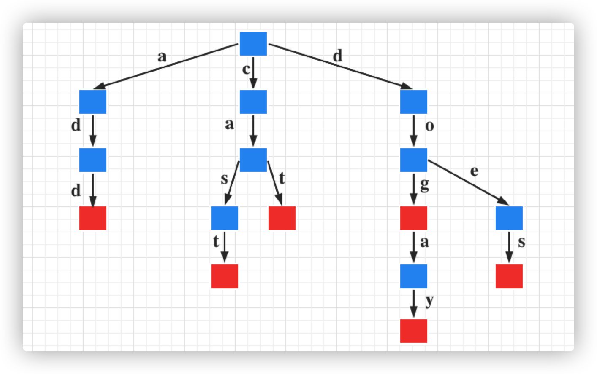

## Trie Tree 是什么

在计算机科学中，trie，是一种有序树，用于保存关联数组，其中的键通常是字符串。与二叉查找树不同，键不是直接保存在节点中，而是由节点在树中的位置决定。一个节点的所有子孙都有相同的前缀，也就是这个节点对应的字符串，而根节点对应空字符串。一般情况下，不是所有的节点都有对应的值，只有叶子节点和部分内部节点所对应的键才有相关的值。

多说一下：平时所说的字典树，前缀树，单词查找树指的都是 Trie Tree。

## Trie Tree 的特性

trie 中的键通常是字符串，但也可以是其它的结构。trie 的算法可以很容易地修改为处理其它结构的有序序列，比如一串数字或者形状的排列。它的强大之处在于它的时间复杂度，它的插入和查询时间都为 O(k),其中 k 为 key 的长度，与 trie 树中保存了多少个元素无关。

> Hash 表的插入查询时间复杂度是 O(1)，但是在计算 Hash 的时候，就是 O(k)，而且还有碰撞之类的问题。

trie 的缺点是空间消耗很高。

## Trie Tree 的基本思想

空间换时间，利用字符串的公共前缀来降低查询时间的开销以达到提高效率的目的。

## Trie Tree 的数据结构

利用串来构建一个字典树，这个字典树保存了串的公共前缀信息。

我们以 26 个英文字母来举例 Trie Tree的数据结构（假设每个节点都是小写字母），每一个节点连起来的串是不是为一个存在的英文单词，那么这个节点我们可以这样设计：

```java
private static class Node<V> {
    // 父节点
    Node<V> parent;
    // 子节点
    HashMap<Character, Node<V>> children;
  	// 每一个字母
    Character character;
		// 连接成的单词（真正的值）
    V value;
    // 是否为单词的结尾（是否为一个完成的单词）
    boolean word;

    public Node(Node<V> parent) {
    this.parent = parent;
    }
}
```

每一个 node 可以看成就是一个单词，为什么不存储一整个单词呢？因为从上面（根节点）开始，每个单词字母已经存储过了，没必要再存储一遍，但是我们需要有一个字母，也就是需要有一个 character



Trie Tree 的根节点不包含任何信息，第一个字符串为 add，第一个字母为 a,因此根节点的的字节点肯定不为空，也就是 HashMap<Character, Node<V>> children，Character 不为空，其他同理。

如图所示，红色节点表示在该处可以构成一个单词，很明显的是，如果要查找 add 是否存在，查找长度则为 O(add.len)，如果要采用一般的逐个匹配的办法查找，则查找长度为 O(add.len*children.size)，children.size 表示单词的个数。

比如我们有个场景：已知 n 个由小写字母组成的平均长度为 10 的单词，判断其中是否存在某个串为另一个串的前缀字串，有以下几种方法：

1. 最容易想到的：暴力遍历法，即从字符串几种从头往后搜，看每个字符串是否为字符串集中某个字符串的前缀，复杂度为 O(n^2)。
2. 使用 hash：用 hash 存下所有字符串的前缀子串，建立存有字串 hash 的复杂度为 O(n*len)，len为单词长度，查询的复杂度为 O(n) * O(1)=O(n)。
3. 使用 Trie：因为当查询如字符串 add 是否为某个字符串的前缀时，显然以 a、d、d....等不是以 a 开头的字符串就不用查找了，这样迅速缩小查找的范围和提高查找的针对性。所以建立 Trie 的复杂度为 O(n*len)，而建立查询在 trie 中是可以同时执行的，建立的过程也就可以成为查询的过程，hash就不能实现这个功能。所以总的复杂度为O(n * len)，实际查询的复杂度只是O(len)。

## Trie Tree 的常用操作

在 Trie 树中主要有 3 个操作，插入、查找和删除。一般情况下 Trie 树中很少存在删除单独某个结点的情况，~~因此只考虑删除整棵树~~，删除的时候我们需要明确一点就是我们删除的单词并不是前缀。

### 插入：

1. 如果我们添加的时候已经有这个字符串了，那我们就只需要覆盖就好了。
2. 如果是已经有的字符串比新添加的这个长，那我们把新添加的字符串遍历覆盖，然后把最后一个字符的 word 置为 true。
3. 如果是已经有的字符串比新添加的这个短，那么我们只需要忘最后一个字符串处追加即可，也即是创建新的节点。

```java
public void add(String key, V value){
    // 从根节点开始
    if (root == null) {
      root = new Node<>(null);
    }
    Node<V> node = root;
    int length = key.length();
    // 遍历新添加的key
    for (int i = 0; i < length; i++) {
      char c = key.charAt(i);
      // 取出子节点
      boolean emptyChildren = node.children == null;
      Node<V> childNode = emptyChildren ? null : node.children.get(c);
      // 如果子节点为null,就创建新的节点，然后把创建出来的新的节点放进之前的node中
      if (childNode == null) {
        childNode = new Node<>(node);
        childNode.character = c;
        node.children = emptyChildren ? new HashMap<>() : node.children;
        node.children.put(c, childNode);
      }
      node = childNode;
    }
    // 如果可以来的这里，就说明for循环已经走完，已经添加完
    // 已经存在这个单词就覆盖
    if (node.word) {
      V oldValue = node.value;
      node.value = value;
      return oldValue;
    }
    // 可以来到这里，说明是新增一个节点
    node.word = true;
    node.value = value;
    size++;
}			

```

### 查找:

根据 key 查询 value

```java
public V get(String key) {
    Node<V> node = node(key);
    return node == null ? null : node.value;
}

private Node<V> node(String key) {
    //if (root == null) return null;
    keyCheck(key);

    Node<V> node = this.root;
    int length = key.length();
    for (int i = 0; i < length; i++) {
      //这里之所以不这样写的原因就是因为node（root）可能为空,所以给Node增加get的构造方法，然后在返回值中判断，如果为空先new一个
      //Node<V> node1 = node.getChildren().get(c);
      //            if (node1==null) return null;
      //Node<V> vNode = node().children.get(c);
      // 当然也可以这么写，如果这么写就需要现在这里判断下
      if (node == null || node.children == null || node.children.isEmpty()) {
        return null;
      }
      char c = key.charAt(i);
      node = node.children.get(c);
    }
    return node;
}
```

### 删除：

1. 如果单词存在才删，不存在就不删。
2. 如果要删除的单词后面还有节点，就不能直接删除，因为他还是后面单词的一部分，这个时候只需要把这个要删单词的最后一位变成不是一个单词的最后字符就好了（word 为 false）。
3. 如果没有节点，还需要看待删单词的最后一个节点有没有其他的子节点（或者他是某个单词的最后一个字符 'word 为 true' ），也不能删除。
4. 如果上述条件都过了，我们就删，以此往上推即可

```java
public V remove(String key) {
    // 找到最后一个子节点
    Node<V> node = node(key);
    // 如果是单词结尾，不用做任何处理
    if (node == null || !node.word) {
    	return null;
    }
    size--;
    V oldValue = node.value;
    //如果还有子节点
    if (node.children != null && !node.children.isEmpty()) {
      node.word = false;
      node.value = null;
      return oldValue;
    }
    //如果没有子节点
    Node<V> parent = null;
    while ((parent = node.parent) != null) {
      parent.children.remove(node.character);
      if (parent.word || !parent.children.isEmpty()) {
      	break;
    	}
    	node = parent;
    }
    return oldValue;
}
```

常用的还有一个就是判断是否以某一个 key 为前缀，其实就是上面封装好的 node(String key) 方法：

```java
public boolean startWith(String prefix) {
    //keyCheck(prefix);
    return node(prefix) != null;
}
```

## Trie Tree 的应用

trie 树常用于搜索提示。如当输入一个网址，可以自动搜索出可能的选择。当没有完全匹配的搜索结果，可以返回前缀最相似的可能。

## Trie Tree 相关的数据结构和算法

Double-array Trie:一种空间复杂度低的 Trie 树，应用于字符区间大的语言（如中文、日文等）分词领域。

> 双数组 Trie (Double-Array Trie) 结构由日本人JUN-ICHI AOE 于 1989 年提出的，是 Trie 结构的压缩形式，仅用两个线性数组来表示 Trie 树，该结构有效结合了数字搜索树(Digital Search Tree)检索时间高效的特点和链式表示的 Trie 空间结构紧凑的特点。双数组 Trie 的本质是一个确定有限状态自动机（DFA），每个节点代表自动机的一个状态，根据变量不同，进行状态转移，当到达结束状态或无法转移时，完成一次查询操作。在双数组所有键中包含的字符之间的联系都是通过简单的数学加法运算表示，不仅提高了检索速度，而且省去了链式结构中使用的大量指针，节省了存储空间。——《基于双数组 Trie 树算法的字典改进和实现》

Suffix Tree:通过对一个字符串所有后缀操作构建一棵树，可以支持字符串的快速匹配查询

Merkle tree:通常运用在比特币网络中，merkle 树被用来归纳一个区块中的所有交易，同时生成整个交易集合的数字指纹

Merkle Patricia tree:一种经过改良的、融合了默克尔树和前缀树两种树结构优点的数据结构，是以太坊中用来组织管理账户数据、生成交易集合哈希的重要数据结构

Crit-bit Tree:一颗用于分类和回归的树（暂时保留准确性，还没查到具体的信息）

AC 自动机:是一种多模式匹配算法，它由贝尔实验室的两位研究人员 Alfred V. Aho 和 Margaret J.Corasick 于 1975 年发明，几乎与 KMP 算法同时问世，至今仍然在模式匹配领域被广泛应用。

> KMP 算法:一种改进的字符串匹配算法

## Tire Tree 的总结

优点：搜索前缀的效率主要于前缀的长度有关

缺点：需要消耗大量的内存，因此还需要改进

完整代码：

```java
public class TrieTree<V> {

    private int size;

    private Node<V> root;

    public int size() {
       return this.size;
    }

    public boolean isEmpty() {
       return false;
    }

    public void clear() {
      size = 0;
      root = null;
    }

    public V get(String key) {
      Node<V> node = node(key);
      return node == null ? null : node.value;
    }

    /**
     * @param key
     * @return
     */
    public boolean contains(String key) {
       return node(key) != null;
    }

    /**
     * @param key
     * @param value
     */
    public V add(String key, V value) {
      keyCheck(key);
      if (root == null) {
        root = new Node<>(null);
      }
      Node<V> node = root;
      int length = key.length();
      for (int i = 0; i < length; i++) {
        char c = key.charAt(i);
        boolean emptyChildren = node.children == null;
        Node<V> childNode = emptyChildren ? null : node.children.get(c);
        if (childNode == null) {
          childNode = new Node<>(node);
          childNode.character = c;
          node.children = emptyChildren ? new HashMap<>() : node.children;
          node.children.put(c, childNode);
        }
        node = childNode;
      }
      if (node.word) {
        V oldValue = node.value;
        node.value = value;
        return oldValue;
      }
      node.word = true;
      node.value = value;
      size++;
      return null;
    }

    /**
     * @param key
     * @return
     */
    public V remove(String key) {
      Node<V> node = node(key);
      if (node == null || !node.word) {
        return null;
      }
      size--;
      V oldValue = node.value;
      if (node.children != null && !node.children.isEmpty()) {
        node.word = false;
        node.value = null;
        return oldValue;
      }
      Node<V> parent = null;
      while ((parent = node.parent) != null) {
        parent.children.remove(node.character);
        if (parent.word || !parent.children.isEmpty()) {
          break;
        }
        node = parent;
      }
      return oldValue;
    }

    /**
     * @param prefix
     * @return
     */
    public boolean startWith(String prefix) {
        //keyCheck(prefix);
        return node(prefix) != null;
    }

    /**
     * @param key
     * @return
     */
    private Node<V> node(String key) {
      //if (root == null) return null;
      keyCheck(key);

      Node<V> node = this.root;
      int length = key.length();
      for (int i = 0; i < length; i++) {
        //Node<V> node1 = node.getChildren().get(c);
        //            if (node1==null) return null;
        //Node<V> vNode = node().children.get(c);
        if (node == null || node.children == null || node.children.isEmpty()) {
          return null;
        }
        char c = key.charAt(i);
        node = node.children.get(c);
      }
      return node;
    }

    private void keyCheck(String key) {
      if (key == null || key.length() == 0) {
        throw new IllegalArgumentException("key must not be empty");
      }
    }

    /**
     * @param <V>
     */
    private static class Node<V> {
      Node<V> parent;
      HashMap<Character, Node<V>> children;
      Character character;

      V value;
      boolean word;

      public Node(Node<V> parent) {
        this.parent = parent;
      }
  	}
}
```

