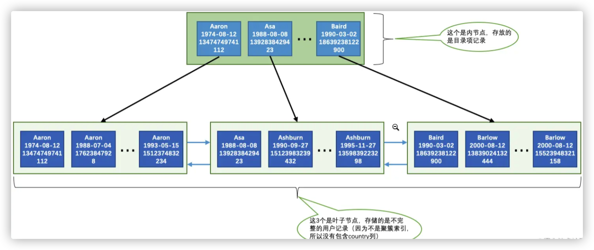
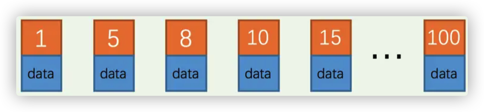
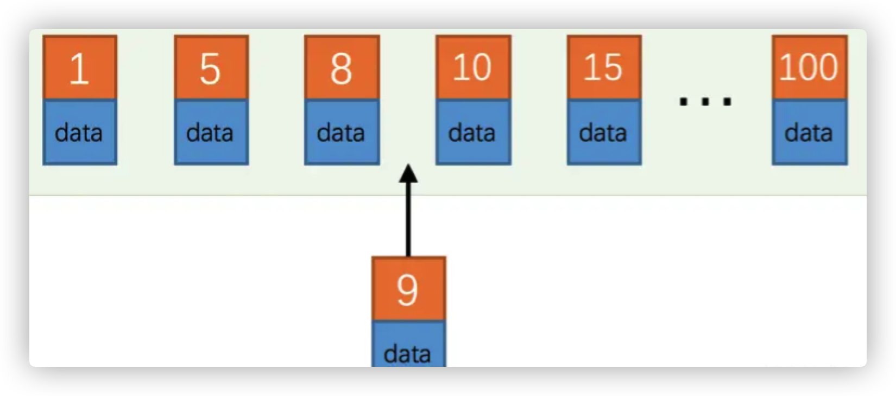

## 回顾上一篇关于索引的一些知识点：

- 一个索引就是一颗`B+`树，`B+`树有很多层，最下面是叶子节点，其余的都是内节点（非叶子节点）。所有的用户记录都存储在B+的`叶子节点上`，所有的`目录项纪录`都存储在`非叶子节点`
- InnoDB 存储引擎会自动为`主键`（如果创建表的时候没有）建立`聚簇索引`，聚簇索引的叶子节点包含`完整的用户记录`。
- 可以自定义为某些列建立二级索引，二级索引的叶子节点包含的用户记录由`索引列+主键`组成，所以如果需要通过二级索引来查找完整的用户记录，需要通过`回表`操作，也就是通过二级索引找到主键之后再到聚簇索引中查找完整的用户记录。
- B+树中每层节点都按照索引列`从小到大`的顺序排序组成了`双向链表`，而且每个页内的纪录（不论是用户记录还是目录项纪录，就是说无论是叶子节点还是非叶子节点）都是按照`索引列的值`从小到大的顺序而形成了一个`单链表`。如果是联合索引，则先按照联合索引`左边的列排序`，如果该列值相同，依次从左到右排序。
- 通过索引查找记录是从`B+`树的根节点开始，一层一层向下搜索。由于每个页面都按照索引列的值建立了`Page Directory`（页目录），所以在这些页面中的查找非常快(二分查找)。

## 建立索引的代价

建立索引在空间和时间上都有代价

- 空间上的代价

  很好理解，每建立一个`索引`，就要为它建立一颗`B+树`，每棵B+树的`每一个节点`都是一个`数据页`，一个页默认会占用`16KB`的存储空间，一颗很大的B+树由许多的数据页组成。

- 时间上的代价

  每次对表中的数据进行增删查改，都需要去修改各个B+树的索引。还有很重要的一点是：`B+`树每层节点都是按照索引列的值从小到大的顺序排序而组成了双向链表。不论是叶子节点中的记录，还是内节点中的记录（也就是不论是用户记录还是目录项记录）都是按照索引列的值从小到大的顺序而形成了一个单向链表。而增、删、改操作可能会对`节点和记录`的排序造成破坏，所以存储引擎需要额外的时间进行一些记录`移位`，页面`分裂`、页面`回收`啥的操作来`维护好节点和记录的排序`。如果我们建了许多索引，每个索引对应的`B+`树都要进行相关的维护操作，这对CPU来说是一笔不小的开销。

## B+索引举例解释

创建一张表

```sql
CREATE TABLE person_info(
    id INT NOT NULL auto_increment,
    name VARCHAR(100) NOT NULL,
    birthday DATE NOT NULL,
    phone_number CHAR(11) NOT NULL,
    country varchar(100) NOT NULL,
    PRIMARY KEY (id),
    KEY idx_name_birthday_phone_number (name, birthday, phone_number)
);
```

这张建表的sql语句有两点需要注意下：

- 表中的主键是id列，它存储了一个自动递增的整数，索引InnoDB引擎会自动为id列建立聚簇索引
- 额外定义了一个二级索引idx_name_birthday_phone_number，由3个字段（name, birthday, phone_number）组成。所以在这个索引对应的`B+`树的叶子节点处存储的用户记录只保留`name`、`birthday`、`phone_number`这三个列的值以及主键`id`的值，并不会保存`country`列的值

所以InnoDB就为这张表建立了两棵B+树（`聚簇索引`和`idx_name_birthday_phone_number`），聚簇索引的这棵B+树其实没什么好说的，整行的用户记录都存储在了叶子节点上，主要说下这棵二级索引建立的B+树:



叶子节点上只有name, birthday, phone_number这三列的记录，它们的排序记录方式是这样的：

- 先按照`name`列的值进行排序
- 如果`name`列的值相同，则按照`birthday`列的值进行排序
- 如果`birthday`列的值也相同，则按照`phone_number`的值进行排序

这个排序方式十分、特别、非常、巨重要，因为只要页面和记录是排好序的，可以通过二分法来快速定位查找。

### 全值匹配

如果搜索条件中的列和索引列一致的话，这种情况就是全值匹配，比如：

```sql
SELECT * FROM person_info WHERE name = 'Ashburn' AND birthday = '1990-09-27' AND phone_number = '15123983239';
```

这个查询过程大致是这样的：

- 因为`B+`树的数据页和记录先是按照`name`列的值进行排序的，所以先可以很快定位`name`列的值是`Ashburn`的记录位置
- 在`name`列相同的记录里又是按照`birthday`列的值进行排序的，所以在`name`列的值是`Ashburn`的记录里又可以快速定位`birthday`列的值是`'1990-09-27'`的记录
- 如果很不幸，`name`和`birthday`列的值都是相同的，那记录是按照`phone_number`列的值排序的，所以联合索引中的三个列都可能被用到

如果我们的查询顺序发生改变了，比如是这样：

```mysql
SELECT * FROM person_info WHERE birthday = '1990-09-27' AND phone_number = '15123983239' AND name = 'Ashburn';
```

那还会对查询过程有影响吗？答案是没有，因为mysqy会有个叫做`查询优化器`的东西来决定先使用哪个搜索条件，后使用哪个搜索条件，后面会专门说这个东西。

### 匹配最左边的列

其实搜索条件中也可以不用包含全部联合索引中的列，只包含最左边的列就行，比如：

```mysql
SELECT * FROM person_info WHERE name = 'Ashburn'; -- 或者
SELECT * FROM person_info WHERE name = 'Ashburn' AND birthday = '1990-09-27'
```

搜索条件中必须出现左边的列才可以使用到这个`B+`树索引，比如下边的语句就用不到这个`B+`树索引。

```mysql
SELECT * FROM person_info WHERE birthday = '1990-09-27';
```

因为`B+`树的数据页和记录先是按照`name`列的值排序的，在`name`列的值相同的情况下才使用`birthday`列进行排序，也就是说`name`列的值不同的记录中`birthday`的值可能是无序的。而现在你跳过`name`列直接根据`birthday`的值去查找，肯定不行。

还有一点需要注意的是：使用联合索引中尽可能多的列，搜索条件中的各个列必须是联合索引中从最左边连续的列。比方说联合索引`idx_name_birthday_phone_number`中列的定义顺序是`name`、`birthday`、`phone_number`，如果搜索条件中只有`name`和`phone_number`，而没有中间的`birthday`，比方说这样：

```mysql
SELECT * FROM person_info WHERE name = 'Ashburn' AND phone_number = '15123983239';
```

这样只能用到`name`列的索引，`birthday`和`phone_number`的索引就用不上了，因为`name`值相同的记录先按照`birthday`的值进行排序，`birthday`值相同的记录才按照`phone_number`值进行排序

### 匹配列前缀

为某个列建立索引，其实说白了就是在为对应的B+树中的记录使用使用该列的值进行排序，比方说`person_info`表上建立的联合索引`idx_name_birthday_phone_number`会先用`name`列的值进行排序，所以这个联合索引对应的`B+`树中的记录的`name`列的排列就是这样的：

```sql
Aaron
Aaron
...
Aaron
Asa
Ashburn
...
Ashburn
Baird
Barlow
...
Barlow
```

字符串排序的本质就是比较哪个字符串大一点儿，哪个字符串小一点，比较字符串大小就用到了该列的字符集和比较规则，其实就是mysql自定义的字符串比较规则。这个过程大致是这样的：

- 先比较字符串的第一个字符，第一个字符小的那个字符串就比较小。
- 如果两个字符串的第一个字符相同，那就再比较第二个字符，第二个字符比较小的那个字符串就比较小。
- 如果两个字符串的第二个字符也相同，那就接着比较第三个字符，依此类推。

所以一个排好序的字符串列其实有这样的特点：

- 先按照字符串的第一个字符进行排序。
- 如果第一个字符相同再按照第二个字符进行排序。
- 如果第二个字符相同再按照第三个字符进行排序，依此类推。

也就是说这些字符串的前n个字符，也就是前缀都是排好序的，所以对于字符串类型的索引列来说，只匹配它的前缀也是可以快速定位记录的，比方说查询名字以`'As'`开头的记录，那就可以这么写查询语句：

```mysql
SELECT * FROM person_info WHERE name LIKE 'As%';
```

但是需要注意的是，如果只给出后缀或者中间的某个字符串，比如这样：

```mysql
SELECT * FROM person_info WHERE name LIKE '%As%';
```

`MySQL`就无法快速定位记录位置了，因为字符串中间有`'As'`的字符串并没有排好序，所以只能全表扫描了

### 匹配范围值

看下上面的`idx_name_birthday_phone_number`索引的`B+`树示意图，所有记录都是按照索引列的值从小到大的顺序排好序的，所以这极大的方便查找索引列的值在某个范围内的记录。比方说下边这个查询语句：

```mysql
SELECT * FROM person_info WHERE name > 'Asa' AND name < 'Barlow';
```

由于`B+`树中的数据页和记录是先按`name`列排序的，所以上边的查询过程其实是这样的：

- 通过B+树在叶子节点中找到第一条`name`值大于`Asa`的二级索引记录，读取该记录的主键值进行回表操作，获得对应的聚簇索引记录后发送给客户端。
- 根据上一步找到的记录，沿着记录所在的链表向后查找（同一页面中的记录使用单向链表连接起来，数据页之间用双向链表连接起来）下一条二级索引记录，判断该记录是否符合name < 'Barlow'条件，如果符合，则进行回表操作后发送至客户端。
- 重复上一步骤，直到某条二级索引记录不符合name <'Barlow'条件为止。

不过在使用联合进行范围查找的时候需要注意，如果对多个列同时进行范围查找的话，只有对索引最左边的那个列进行范围查找的时候才能用到`B+`树索引，比方说这样：

```sql
SELECT * FROM person_info WHERE name > 'Asa' AND name < 'Barlow' AND birthday > '1980-01-01';
```

上边这个查询可以分成两个部分：

1. 通过条件`name > 'Asa' AND name < 'Barlow' `来对`name`进行范围，查找的结果可能有多条`name`值不同的记录，
2. 对这些`name`值不同的记录继续通过`birthday > '1980-01-01'`条件继续过滤。

这样子对于联合索引`idx_name_birthday_phone_number`来说，只能用到`name`列的部分，而用不到`birthday`列的部分，因为只有`name`值相同的情况下才能用`birthday`列的值进行排序，而这个查询中通过`name`进行范围查找的记录中可能并不是按照`birthday`列进行排序的，所以在搜索条件中继续以`birthday`列进行查找时是用不到这个`B+`树索引的。

### 精确匹配某一列并范围匹配另外一列

对于同一个联合索引来说，虽然对多个列都进行范围查找时只能用到最左边那个索引列，但是如果左边的列是精确查找，则右边的列可以进行范围查找，比方说这样：

```sql
SELECT * FROM person_info WHERE name = 'Ashburn' AND birthday > '1980-01-01' AND birthday < '2000-12-31' AND phone_number > '15100000000';
```

这个查询的条件可以分为3个部分：

1. `name = 'Ashburn'`，对`name`列进行精确查找，当然可以使用`B+`树索引了。
2. `birthday > '1980-01-01' AND birthday < '2000-12-31'`，由于`name`列是精确查找，所以通过`name = 'Ashburn'`条件查找后得到的结果的`name`值都是相同的，它们会再按照`birthday`的值进行排序。所以此时对`birthday`列进行范围查找是可以用到`B+`树索引的。
3. `phone_number > '15100000000'`，通过`birthday`的范围查找的记录的`birthday`的值可能不同，所以这个条件无法再利用`B+`树索引了，只能遍历上一步查询得到的记录。

同理，下边的查询也是可能用到这个`idx_name_birthday_phone_number`联合索引的：

```sql
SELECT * FROM person_info WHERE name = 'Ashburn' AND birthday = '1980-01-01' AND phone_number > '15100000000';
```

### 用于排序

sql语句中的排序是经常见到的，比如这条sql：

```mysql
SELECT * FROM person_info ORDER BY name, birthday, phone_number LIMIT 10;
```

这个查询的结果集需要先按照`name`值排序，如果记录的`name`值相同，则需要按照`birthday`来排序，如果`birthday`的值相同，则需要按照`phone_number`排序。上面建立的`idx_name_birthday_phone_number`索引的示意图，因为这个`B+`树索引本身就是按照上述规则排好序的，所以直接从索引中提取数据，然后进行`回表`操作取出该索引中不包含的列就好了。

#### 使用联合索引进行排序注意事项

对于`联合索引`有个问题需要注意，`ORDER BY`的子句后边的列的顺序也必须按照索引列的顺序给出，如果给出`ORDER BY phone_number, birthday, name`的顺序，那也是用不了`B+`树索引，这种颠倒顺序其实就是上面说的那样。

同理，`ORDER BY name`、`ORDER BY name, birthday`这种匹配索引左边的列的形式可以使用部分的`B+`树索引。当联合索引左边列的值为常量，也可以使用后边的列进行排序，比如这样：

```mysql
SELECT * FROM person_info WHERE name = 'A' ORDER BY birthday, phone_number LIMIT 10;
```

这个查询能使用联合索引进行排序是因为`name`列的值相同的记录是按照`birthday`, `phone_number`排序的。

#### 不可以使用索引进行排序的几种情况

1. ##### ASC、DESC混用

   对于使用联合索引进行排序的场景，要求各个排序列的排序顺序是一致的，也就是要么各个列都是`ASC`规则排序，要么都是`DESC`规则排序

   > ```
   > ORDER BY子句后的列如果不加ASC或者DESC默认是按照ASC排序规则排序的，也就是升序排序的
   > ```

为什么会有这样的规定？想想`idx_name_birthday_phone_number`联合索引中记录的结构：

- 先按照记录的`name`列的值进行升序排列。
- 如果记录的`name`列的值相同，再按照`birthday`列的值进行升序排列。
- 如果记录的`birthday`列的值相同，再按照`phone_number`列的值进行升序排列。

如果查询中的各个排序列的排序顺序是一致的，比方说下边这两种情况：

- `ORDER BY name, birthday LIMIT 10`

  这种情况直接从索引的最左边开始往右读10行记录就可以了

- `ORDER BY name DESC, birthday DESC LIMIT 10`

  这种情况直接从索引的最右边开始往左读10行记录就可以了

但是如果查询的需求是先按照`name`列进行升序排列，再按照`birthday`列进行降序排列的话，比如说这样的查询语句:

```sql
SELECT * FROM person_info ORDER BY name, birthday DESC LIMIT 10;
```

这样如果使用索引排序的话过程就是这样的：

- 先从索引的最左边确定`name`列最小的值，然后找到`name`列等于该值的所有记录，然后从`name`列等于该值的最右边的那条记录开始往左找10条记录。
- 如果`name`列等于最小的值的记录不足10条，再继续往右找`name`值第二小的记录，重复上边那个过程，直到找到10条记录为止

这样就非常的复杂，而且还不能高效使用索引，所以在日常写sql中最好的查询条件的排序规则是一致的。

## 回表的代价

先看一条sql:

```sql
SELECT * FROM person_info WHERE name > 'Asa' AND name < 'Barlow';
```

在使用`idx_name_birthday_phone_number`索引进行查询时大致可以分为这两个步骤：

1. 从索引`idx_name_birthday_phone_number`对应的`B+`树中取出`name`值在`Asa`～`Barlow`之间的用户记录。
2. 由于索引`idx_name_birthday_phone_number`对应的`B+`树用户记录中只包含`name`、`birthday`、`phone_number`、`id`这4个字段，而查询列表是`*`，意味着要查询表中所有字段，也就是还要包括`country`字段。这时需要把从上一步中获取到的每一条记录的`id`字段都到聚簇索引对应的`B+`树中找到完整的用户记录，也就是我们通常所说的`回表`，然后把完整的用户记录返回给查询用户。

由于索引`idx_name_birthday_phone_number`对应的`B+`树中的记录首先会按照`name`列的值进行排序，所以值在`Asa`～`Barlow`之间的记录在磁盘中的存储是相连的，集中分布在一个或几个数据页中，可以很快的把这些连着的记录从磁盘中读出来，这种读取方式就是`顺序I/O`。

根据第1步中获取到的记录的`id`字段的值可能并不相连，而在聚簇索引中记录是根据`id`（也就是主键）的顺序排列的，所以根据这些并不连续的`id`值到聚簇索引中访问完整的用户记录可能分布在不同的数据页中，这样读取完整的用户记录可能要访问更多的数据页，这种读取方式就是`随机I/O`。

一般情况下，顺序I/O比随机I/O的性能高很多，所以步骤1的执行可能很快，而步骤2就慢一些。所以这个使用索引`idx_name_birthday_phone_number`的查询有这么两个特点：

- 会使用到两个`B+`树索引，一个二级索引，一个聚簇索引。
- 访问二级索引使用`顺序I/O`，访问聚簇索引使用`随机I/O`。

需要回表的记录越多，使用二级索引的性能就越低，甚至让某些查询宁愿使用全表扫描也不使用`二级索引`。比方说`name`值在`Asa`～`Barlow`之间的用户记录数量占全部记录数量90%以上，那么如果使用`idx_name_birthday_phone_number`索引的话，有90%多的`id`值需要回表，这就不好，还不如直接去扫描聚簇索引（也就是全表扫描）。

那什么时候采用全表扫描的方式，什么时候使用采用`二级索引 + 回表`的方式去执行查询呢？

这个就是传说中的查询优化器做的工作，查询优化器会事先对表中的记录计算一些统计数据，然后再利用这些统计数据根据查询的条件来计算一下需要回表的记录数，需要回表的记录数越多，就越倾向于使用全表扫描，反之倾向于使用`二级索引 + 回表`的方式。当然优化器做的分析工作不仅仅是这么简单，但是大致上是个这个过程。

一般情况下，限制查询获取较少的记录数会让优化器更倾向于选择使用`二级索引 + 回表`的方式进行查询，因为回表的记录越少，性能提升就越高，比方说上边的查询可以改写成这样：

```
SELECT * FROM person_info WHERE name > 'Asa' AND name < 'Barlow' LIMIT 10;
```

添加了`LIMIT 10`的查询更容易让优化器采用`二级索引 + 回表`的方式进行查询。

对于有排序需求的查询，上边讨论的采用`全表扫描`还是`二级索引 + 回表`的方式进行查询的条件也是成立的，比方说下边这个查询：

```
SELECT * FROM person_info ORDER BY name, birthday, phone_number;
```

由于查询列表是`*`，所以如果使用二级索引进行排序的话，需要把排序完的二级索引记录全部进行回表操作，这样操作的成本还不如直接遍历聚簇索引然后再进行文件排序（`filesort`）低，所以优化器会倾向于使用`全表扫描`的方式执行查询。如果加了`LIMIT`子句，比如这样：

```
SELECT * FROM person_info ORDER BY name, birthday, phone_number LIMIT 10;
```

这样需要回表的记录特别少，优化器就会倾向于使用`二级索引 + 回表`的方式执行查。

查询优化器的工作原理大致就是这样，后面会详细再说这个。

#### 覆盖索引

为了彻底告别`回表`操作带来的性能损耗，建议：最好在查询列表里只包含索引列，比如这样：

```sql
SELECT name, birthday, phone_number FROM person_info WHERE name > 'Asa' AND name < 'Barlow'
```

只查询`name`, `birthday`, `phone_number`这三个索引列的值，所以在通过`idx_name_birthday_phone_number`索引得到结果后就不必到`聚簇索引`中再查找记录的剩余列，也就是`country`列的值了，这样就省去了`回表`操作带来的性能损耗。这种只需要用到索引的查询方式称为`索引覆盖`。排序操作也优先使用`覆盖索引`的方式进行查询，比方说这个查询：

```sql
SELECT name, birthday, phone_number  FROM person_info ORDER BY name, birthday, phone_number;
```

然这个查询中没有`LIMIT`子句，但是采用了`覆盖索引`，所以查询优化器就会直接使用`idx_name_birthday_phone_number`索引进行排序而不需要回表操作了。

当然，如果业务需要查询出索引以外的列，那还是以保证业务需求为重。但是很不鼓励用`*`号作为查询列表，最好把需要查询的列依次标明。

## 如何创建一个`好`的索引

### 只为用于搜索、排序或分组的列创建索引

这个没什么好说的，上面说了这个多

### 考虑列的基数

`列的基数`指的是某一列中不重复数据的个数，比方说某个列包含值`2, 5, 8, 2, 5, 8, 2, 5, 8`，虽然有`9`条记录，但该列的基数却是`3`。也就是说，在记录行数一定的情况下，列的基数越大，该列中的值越分散，列的基数越小，该列中的值越集中。这个`列的基数`指标非常重要，直接影响我们是否能有效的利用索引。假设某个列的基数为`1`，也就是所有记录在该列中的值都一样，那为该列建立索引是没有用的，因为所有值都一样就无法排序，无法进行快速查找了～ 而且如果某个建立了二级索引的列的重复值特别多，那么使用这个二级索引查出的记录还可能要做回表操作，这样性能损耗就更大了。所以结论就是：最好为那些列的基数大的列建立索引，为基数太小列的建立索引效果可能不好。

举个简单的例子，一张表中有一个性别字段，那么为这个性别字段建立索引就不是一个好的选择，说白了就是区分度需要大。最好就是只查出一条记录。

### 索引列的类型尽量小

定义表结构的时候要显式的指定列的类型，以整数类型为例，有`TINYINT`、`MEDIUMINT`、`INT`、`BIGINT`这么几种，它们占用的存储空间依次递增，这里所说的`类型大小`指的就是该类型表示的数据范围的大小。能表示的整数范围当然也是依次递增，如果想要对某个整数列建立索引的话，在表示的整数范围允许的情况下，尽量让索引列使用较小的类型，比如我们能使用`INT`就不要使用`BIGINT`，能使用`MEDIUMINT`就不要使用`INT`～ 这是因为：

- 数据类型越小，在查询时进行的比较操作越快（这是CPU层次的东东）
- 数据类型越小，索引占用的存储空间就越少，在一个数据页内就可以放下更多的记录，从而减少磁盘`I/O`带来的性能损耗，也就意味着可以把更多的数据页缓存在内存中，从而加快读写效率。

这个建议对于表的主键来说更加适用，因为不仅是聚簇索引中会存储主键值，其他所有的二级索引的节点处都会存储一份记录的主键值，如果主键适用更小的数据类型，也就意味着节省更多的存储空间和更高效的`I/O`。

### 索引字符串值的前缀

一个字符串其实是由若干个字符组成，如果在`MySQL`中使用`utf8`字符集去存储字符串的话，编码一个字符需要占用`1~3`个字节。假设字符串很长，那存储一个字符串就需要占用很大的存储空间。需要为这个字符串列建立索引时，那就意味着在对应的`B+`树中有这么两个问题：

- `B+`树索引中的记录需要把该列的完整字符串存储起来，而且字符串越长，在索引中占用的存储空间越大。
- 如果`B+`树索引中索引列存储的字符串很长，那在做字符串比较时会占用更多的时间。

前边儿说过索引列的字符串前缀其实也是排好序的，所以索引的设计者提出了个方案 --- 只对字符串的前几个字符进行索引也就是说在二级索引的记录中只保留字符串前几个字符。这样在查找记录时虽然不能精确的定位到记录的位置，但是能定位到相应前缀所在的位置，然后根据前缀相同的记录的主键值回表查询完整的字符串值，再对比就好了。这样只在`B+`树中存储字符串的前几个字符的编码，既节约空间，又减少了字符串的比较时间，还大概能解决排序的问题，何乐而不为，比方说在建表语句中只对`name`列的前10个字符进行索引可以这么写：

```
CREATE TABLE person_info(
    name VARCHAR(100) NOT NULL,
    birthday DATE NOT NULL,
    phone_number CHAR(11) NOT NULL,
    country varchar(100) NOT NULL,
    KEY idx_name_birthday_phone_number (name(10), birthday, phone_number)
);    
```

`name(10)`就表示在建立的`B+`树索引中只保留记录的前`10`个字符的编码，这种只索引字符串值的前缀的策略非常鼓励的，尤其是在字符串类型能存储的字符比较多的时候。

#### 索引列前缀对排序的影响

如果使用了索引列前缀，比方说前边只把`name`列的前10个字符放到了二级索引中，下边这个查询可能就不好：

```sql
SELECT * FROM person_info ORDER BY name LIMIT 10;	
```

因为二级索引中不包含完整的`name`列信息，所以无法对前十个字符相同，后边的字符不同的记录进行排序，也就是使用索引列前缀的方式无法支持使用索引排序。

### 让索引列在比较表达式中单独出现

假设表中有一个整数列`my_col`，为这个列建立了索引。下边的两个`WHERE`子句虽然语义是一致的，但是在效率上却有差别：

1. `WHERE my_col * 2 < 4`
2. `WHERE my_col < 4/2`

第1个`WHERE`子句中`my_col`列并不是以单独列的形式出现的，而是以`my_col * 2`这样的表达式的形式出现的，存储引擎会依次遍历所有的记录，计算这个表达式的值是不是小于`4`，所以这种情况下是使用不到为`my_col`列建立的`B+`树索引的。而第2个`WHERE`子句中`my_col`列并是以单独列的形式出现的，这样的情况可以直接使用`B+`树索引。

所以结论就是：如果索引列在比较表达式中不是以单独列的形式出现，而是以某个表达式，或者函数调用形式出现的话，是用不到索引的。

### 主键插入顺序

对于一个使用`InnoDB`存储引擎的表来说，在没有显式的创建索引时，表中的数据实际上都是存储在`聚簇索引`的叶子节点的。而记 录又是存储在数据页中的，数据页和记录又是按照记录主键值从小到大的顺序进行排序，所以如果插入的记录的主键值是依次增大的话，那每插满一个数据页就换到下一个数据页继续插，而如果插入的主键值忽大忽小的话，这就比较麻烦了，假设某个数据页存储的记录已经满了，它存储的主键值在`1~100`之间：



如果此时再插入一条主键值为`9`的记录，那它插入的位置就如下图：


可这个数据页已经满了啊，再插进来咋办呢？这个时候就需要把当前页面分裂成两个页面，把本页中的一些记录移动到新创建的这个页中。页面分裂和记录移位意味着什么？意味着：性能损耗！所以如果想尽量避免这样无谓的性能损耗，最好让插入的记录的主键值依次递增，这样就不会发生这样的性能损耗了。

所以建议：让主键具有`AUTO_INCREMENT`，让存储引擎自己为表生成主键，而不是自己手动插入 。

## 总结

上面从一张表上面记录了索引的使用和注意事项，总结如下：

1. `B+`树索引在空间和时间上都有代价，所以建立索引的时候一定要慎重。
2. `B+`树索引适用于下边这些情况：
    - 全值匹配
    - 匹配左边的列
    - 匹配范围值
    - 精确匹配某一列并范围匹配另外一列
    - 用于排序
    - 用于分组
3. 在使用索引时需要注意下边这些事项：
    - 只为用于搜索、排序或分组的列创建索引
    - 为列的基数大的列创建索引
    - 索引列的类型尽量小
    - 可以只对字符串值的前缀建立索引
    - 只有索引列在比较表达式中单独出现才可以适用索引
    - 为了尽可能少的让`聚簇索引`发生页面分裂和记录移位的情况，建议让主键拥有`AUTO_INCREMENT`属性。
    - 定位并删除表中的重复和冗余索引
    - 尽量使用`覆盖索引`进行查询，避免`回表`带来的性能损耗。