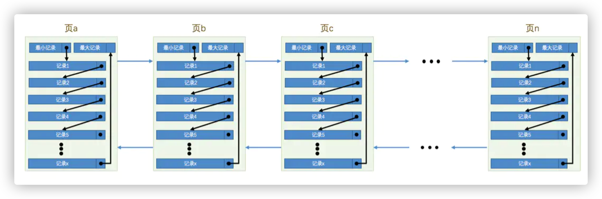
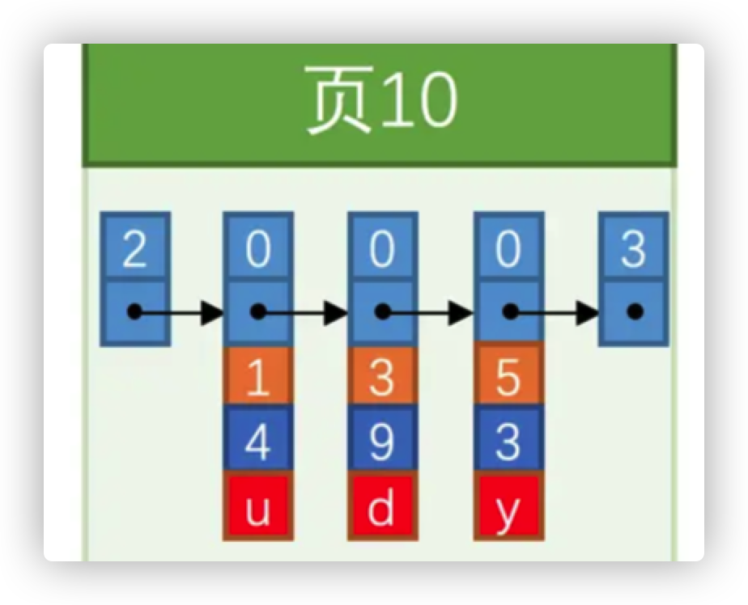
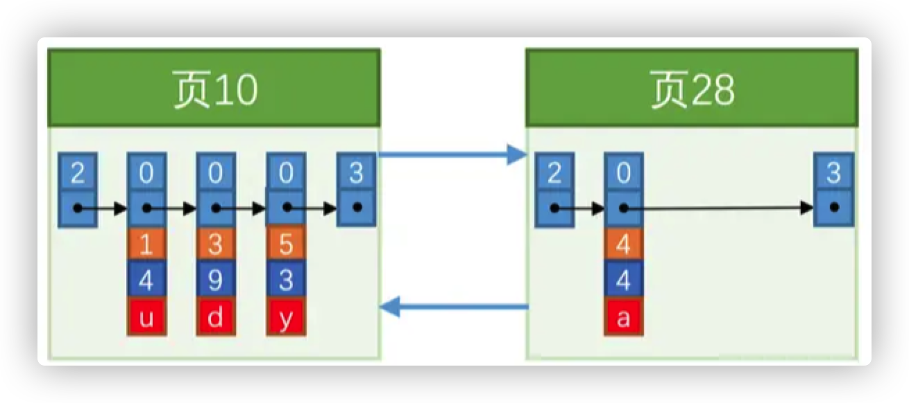
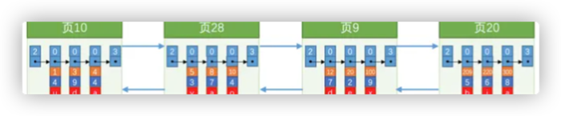
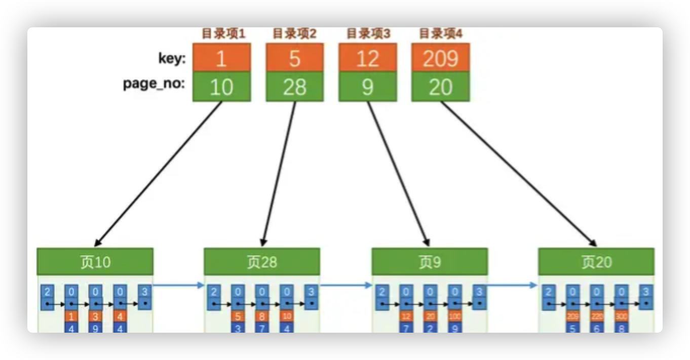
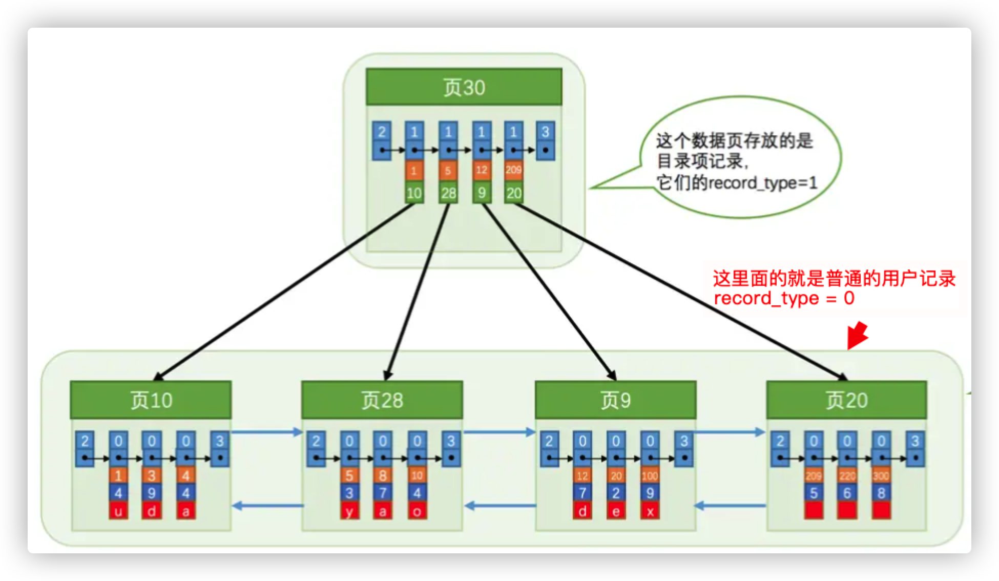

## 前言

在之前学习数据页的时候，知道了每个数据页可以组成一个数据链表，而每个数据页中的记录会按照主键值从小到大的顺序组成一个单向链表，每一个数据页都会为存储在它里面的记录生成一个页目录，通过主键查找的时候可以在页目录中使用二分法快速定位到该数据对应的槽，然后遍历该槽对应的记录就可以快速找到指定的记录。页与记录的关系如下：




页a、页b、页c ... 页n 这些页可以不在物理结构上相连，只要通过双向链表相关联即可。（仔细观察这种形式有没有像某种数据结构）

如果插入数据的时候没有设计成主键自增，那么就会有一个数据行的挪动过程（页分裂），保证下一个数据页的主键值都大于上一个页的主键值。

mysql在设计的时候设计了一个主键索引。一个主键索引里包含了每个数据页跟他的最小主键值，这样就可以组成一个数据目录，然后后面查找主键的时候，就可以在目录里面二分查找直接定位到那条数据所属的数据页，接着在数据页里面在二分查找定位那条数据就可以了。

如果会更多的数据呢，比如几百万，几千万，甚至单表几亿条数据都有可能。这个时候肯定会有大量的数据页，主键目录里面会存储大量的数据页和最小主键值。这肯定不行。这个时候Mysql就采用了B+的数据结构来存储大数据。

## **B+树是如何形成的？**

mysql会把表的实际数据存放在数据页里面，然后表的索引也存放在页里面，这个时候就会产生一个叫做索引页的东西。如果有很多数据，依旧会有跟多的索引页，查找的时候依然不方便，因为不知道到底该去哪一个索引页里面找。

这个时候Mysql的设计者就在此基础上把索引页多加了一个层级出来，在更高的层级里面只保存了每个索引页和索引页里面的最小主键值。这样在查找一个具体数据的时候，就可以先去最顶层的索引页里面找，然后通过二分法定位到下一步的索引页里面去找，以此类推，找到最终的数据。其实不会进行查找的，里面后面会说到。

经过上面这样的流程，进行分层。索引页不知不觉就会变成多个层级，其实这个时候B+树就形成了。

这是最简单最基础的主键索引，当你为一个表的主键建立起索引是，其实这个主键的索引就是一颗B+树，然后根据主键来查找数据的时候，就是从B+树的顶层开始二分查找，一层一层的往下定位，最终一直定位到一个数据页（根节点）上，然后根据二分查找找到需要的那条数据。

这就是索引最真实的物理存储结构，采用跟数据页一样的页结构来存储，一个索引就是很多页组成的一颗B+树。

## Mysql是如何设计索引的？

一个示例清楚索引到底是怎么存储的？

我们在根据某个搜索条件查找一些记录时为什么要遍历所有的数据页呢？因为各个页中的记录并没有规律，我们并不知道我们的搜索条件匹配哪些页中的记录，所以 ***不得不*** 依次遍历所有的数据页。所以如果我们想快速的定位到需要查找的记录在哪些数据页中该咋办？还记得我们为根据主键值快速定位一条记录在页中的位置而设立的页目录么？我们也可以想办法为快速定位记录所在的数据页而建立一个别的目录，建这个目录必须完成下边这些事儿：

- 下一个数据页中用户记录的主键值必须`大于`上一个页中用户记录的主键值

  做一个假设：假设我们的每个数据页最多能存放3条记录（实际上一个数据页非常大，可以存放下好多记录）。有了这个假设之后我们向`index_demo`表插入3条记录：

  ```mysql
  mysql> INSERT INTO index_demo VALUES(1, 4, 'u'), (3, 9, 'd'), (5, 3, 'y');
  Query OK, 3 rows affected (0.01 sec)
  Records: 3  Duplicates: 0  Warnings: 0
  ```

  这些记录会按照主键的大小串联成一个单项链表，如图：


可以看出，`index_demo`表中的3条记录都被插入到了编号为`10`的数据页中了。再插入一条记录：

  ```mysql
  mysql> INSERT INTO index_demo VALUES(4, 4, 'a');
  Query OK, 1 row affected (0.00 sec)
  ```

因为`页10`最多只能存放3条记录（假设），所以需要再分配一个新页：


为什么会是页28呢，因为这是在内存中分配的，不是紧挨连续的，只是通过链表连接起来了（维护着上一个页和下一个页的编号）。页10中的最大的主键ID是5，二页28中为4，因为5>4,这不符合下一个数据页中用户记录的主键值必须大于上一个页中的记录的主键值的要求，所以在插入主键为4的用户记录的时候会伴随着一次记录移动，也就是把主键为5的用户记录移动到页28中，然后再把主键值为4的用户记录插入到页10中，这个过程大概是这样：


这个过程说明了对页中的记录进行增删改的时候，必须通过某种操作（记录移动）来始终保证这个状态一直成立：下一个数据页中用户记录的主键值必须大于上一个数据页中用户记录的主键值。而这个过程就是`页分裂`

- 给所有的页建立一个目录项

  由于数据页的编号可能并不是连续的，所以在向`index_demo`表中插入许多条记录后，可能是这样的效果：



  因为这些`16KB`的页在物理存储上可能并不挨着，所以如果想从这么多页中根据主键值快速定位某些记录所在的页，我们需要给它们做个目录，每个页对应一个目录项，每个目录项包括下边两个部分：

    - 页的用户记录中最小的主键值，用`key`来表示
    - 页号，用`page_no`表示

  所以上面几个页做好的目录就是这样的：
  


    - 以`页28`为例，它对应`目录项2`，这个目录项中包含着该页的页号`28`以及该页中用户记录的最小主键值`5`。我们只需要把几个目录项在物理存储器上连续存储，比如把他们放到一个数组里，就可以实现根据主键值快速查找某条记录的功能了。比方说我们想找主键值为`20`的记录，具体查找过程分两步：
        1. 先从目录项中根据二分法快速确定出主键值为`20`的记录在`目录项3`中（因为 `12 < 20 < 209`），它对应的页是`页9`。
        2. 再根据前边说的在页中查找记录的方式去`页9`中定位具体的记录。

  至此，针对数据页做的简易目录就搞定了。这个`目录`有一个别名，称为`索引`

## InnoDB 中的索引方案

上面的情况可以说是比较笼统的说了一下索引的设计，但是真正落实到生产中，通常数据会更大，一个索引页最多只能保证16KB的连续存储空间，要把这么多的数据全部装下非常的不现实；还有一点就是如果我们要删除一个数据页，那么它对应的目录项就没有存在的意义上，这就需要把删除目录项的该项后的目录都向前移动一下，这种的效率是及其差的。

Mysql 利用存储用户记录的数据页来存储目录项，为了和用户记录进行区分，需要用到存储在数据页里面的数据头信息里面的`record_type`属性，该属性值代表意义如下：

- 0:普通的用户记录
- 1:目录项纪录
- 2:最小记录
- 3:最大记录

把目录项放到数据页中大概就是这样的：

  

这个时候需要区分目录项和用户记录的不同：

- `目录项记录`的`record_type`值是1，而普通用户记录的`record_type`值是0
- `目录项记录`只有主键值和页的编号两个列，而普通的用户记录的列是用户自己定义的，可能包含很多列，另外还有`InnoDB`自己添加的隐藏列
- 还有一点就是记录头信息里面有个`min_rec_mask`的属性，只有在存储`目录项记录`的页中的主键值最小的`目录项记录`的`min_rec_mask`值为`1`，其他别的记录的`min_rec_mask`值都是`0`

举个例子（接着上面）：

比如要查找主键为20的这条记录，步骤如下：

1. 先去存储目录项纪录的页，通过二分法快速定位到对应的目录项,也就是在页30里面。因为`12 < 20 < 209`，所以定位到对应的记录所在的页就是`页9`。
2. 再到存储用户记录的`页9`中根据二分法快速定位到主键值为`20`的用户记录

这个又有问题了，虽然说目录项纪录中值存储主键值和对应的页号，是要比用户记录小点，但是一个数据页在物理空间上也只有16KB，能存放的目录页也是有限的。

这个时候我们就需要看这颗不同寻常的树是怎么生长的

继续上面的例子，如果继续插入一条记录（320），那就需要再分配一个目录项纪录的页，这里假设一个存储目录项的页最多只能存放4条记录。


从图中可以看出：插入320这条记录后，需要生成两个新的数据页：

- 为存储该用户记录而新生成了`页31`
- 因为原先存储`目录项记录`的`页30`的容量已满（前边假设只能存储4条`目录项记录`），所以不得不需要一个新的`页32`来存放`页31`对应的目录项

现在要查询一条用户记录就有这几步了：

1. 确定`目录项记录`页

   现在的存储`目录项记录`的页有两个，即`页30`和`页32`，又因为`页30`表示的目录项的主键值的范围是`[1, 320)`，`页32`表示的目录项的主键值不小于`320`，所以主键值为`20`的记录对应的目录项记录在`页30`中

2. 通过`目录项记录`页确定用户记录真实所在的页

   也就是上面说的通过主键定位一条用户记录

3. 在真实存储用户记录的页中定位到具体的记录

   前面也说过了

这个时候就会又有新的问题出现，表中的数据非常多，根据主键定位依旧比较慢，这个时候就需要再向上生成一个更高级的目录。就像是多级目录似的，大目录里嵌套小目录，小目录里才是实际的数据，把它抽象出来，大概就是这样：


把它倒过来，就是一颗B+树。

不论是存放用户记录的数据页，还是存放目录项记录的数据页，都把它们存放到`B+`树这个数据结构中了，所以也称这些数据页为`节点`。从图中可以看出来，实际用户记录其实都存放在B+树的最底层的节点上，这些节点也被称为`叶子节点`或`叶节点`，其余用来存放`目录项`的节点称为`非叶子节点`或者`内节点`，其中`B+`树最上边的那个节点也称为`根节点`。

从图中可以看出来，一个`B+`树的节点其实可以分成好多层，基于B+树的特性，规定最下边的那层，也就是存放用户记录的那层为第`0`层，之后依次往上加。

做了一个非常极端的假设：存放用户记录的页最多存放3条记录，存放目录项记录的页最多存放4条记录。其实真实环境中一个页存放的记录数量是非常大的，假设，假设，假设所有存放用户记录的叶子节点代表的数据页可以存放100条用户记录，所有存放目录项记录的内节点代表的数据页可以存放1000条目录项记录，那么：

- 如果`B+`树只有1层，也就是只有1个用于存放用户记录的节点，最多能存放`100`条记录。
- 如果`B+`树有2层，最多能存放`1000×100=100000`条记录。
- 如果`B+`树有3层，最多能存放`1000×1000×100=100000000`条记录。
- 如果`B+`树有4层，最多能存放`1000×1000×1000×100=100000000000`条记录。

一张表里能存放`100000000000`条记录么？所以一般情况下，用到的`B+`树都不会超过4层，通过主键值去查找某条记录最多只需要做4个页面内的查找（查找3个目录项页和一个用户记录页），这里需要说一下其实一个层查找就是与磁盘进行一次IO操作，又因为在每个页面内有所谓的`Page Directory`（页目录），所以在页面内也可以通过二分法实现快速定位记录。

## 聚簇索引

上边说的的`B+`树本身就是一个目录，或者说本身就是一个索引。它有两个特点：

1. 使用记录主键值的大小进行记录和页的排序，这包括三个方面的含义：

    - 页内的记录是按照主键的大小顺序排成一个单向链表。
    - 各个存放用户记录的页也是根据页中用户记录的主键大小顺序排成一个双向链表。
    - 存放目录项记录的页分为不同的层次，在同一层次中的页也是根据页中目录项记录的主键大小顺序排成一个双向链表。

2. `B+`树的叶子节点存储的是完整的用户记录。

   所谓完整的用户记录，就是指这个记录中存储了所有列的值（包括隐藏列）。

具有这两种特性的`B+`树称为`聚簇索引`，所有完整的用户记录都存放在这个`聚簇索引`的叶子节点处。这种`聚簇索引`并不需要在`MySQL`语句中显式的使用`INDEX`语句去创建，`InnoDB`存储引擎会自动的创建聚簇索引。另外有趣的一点是，在`InnoDB`存储引擎中，`聚簇索引`就是数据的存储方式（所有的用户记录都存储在了`叶子节点`），也就是所谓的索引即数据，数据即索引

## 二级索引

为什么会有二级索引呢，因为上面的聚簇索引只能在搜索条件为主键时才会有作用，因为`B+`树中的数据都是按照主键进行排序的。那如果要根据别的字段查找呢，不能从头到尾遍历吧。。

这个时候，就可以多建几颗B+树，不同的`B+`树中的数据采用不同的排序规则。这样建出来的和之前聚簇索引建立出来的区别如下：

- 根据什么字段建立出来的索引就是根据什么字段排序，排成一个单向链表
- 各个存放用户记录的页也是根据页中的字段大小排序成一个双向链表
- 存放目录项纪录的页分为不同的层次，在同一层次中的页也是根据页中目录项的字段大小排序成一个双向链表
- `B+`树的叶子节点存储的并不是完整的用户记录，而只是`这个字段列+主键`这两个列的值
- 目录项记录中不再是`主键+页号`的搭配，而变成了`这个字段列+页号`的搭配

举一个简单例子，比如现在有a、b、c、d四个字段，a是主键索引，它建立的就是一颗聚簇索引，要是我们再以c建立一个索引，那它其实就是一个二级索引，以c建立的这颗B+树上面叶子节点上面只有c+a这两个列的值，目录项中也不是a+页号了，变成c+页号了。

那我们我们要查找d,我们就需要先去叶子节点上查找到a+c,然后用a再去主键建立的那颗B+树上的叶子节点上找到d。这个过程就是`回表`

为什么还需要一次`回表`操作呢？直接把完整的用户记录放到`叶子节点`不就好了么？因为如果把完整的用户记录放到`叶子节点`是可以不用`回表`，但是太占地方了呀～相当于每建立一棵`B+`树都需要把所有的用户记录再都拷贝一遍，这就有点太浪费存储空间了。因为这种按照`非主键列`建立的`B+`树需要一次`回表`操作才可以定位到完整的用户记录，所以这种`B+`树也被称为`二级索引`（英文名`secondary index`），或者`辅助索引`。由于我们使用的是`a列`的大小作为`B+`树的排序规则，所以我们也称这个`B+`树为为a列建立的索引.

## 联合索引

借助上面的a、b、c、d的例子学习一下联合索引，加入以b、d两个字段建立索引，让`B+`树按照`b`和`d`列的大小进行排序，这个包含两层含义：

- 先把各个记录和页按照`b`列进行排序
- 在记录的`b`列相同的情况下，采用`d`列进行排序

需要注意一下几点：

- 每条`目录项记录`都由`b`、`d`、`页号`这三个部分组成，各条记录先按照`b`列的值进行排序，如果记录的`b`列相同，则按照`d`列的值进行排序
- `B+`树叶子节点处的用户记录由`b`、`d`和主键`a`列组成

以b和d列的大小为排序规则建立的B+树称为联合索引，本质上也是一个二级索引。它的意思与分别为b和d列分别建立索引的表述是不同的，不同点如下:

- 建立联合索引只会有一颗B+树
- 为b和d列分别建立索引会分别以`b`和`d`列的大小为排序规则建立2棵`B+`树

## 最后还有几点注意事项

B+树的形成过程：

- 每当为某个表创建一个`B+`树索引（聚簇索引不是人为创建的，默认就有）的时候，都会为这个索引创建一个`根节点`页面。最开始表中没有数据的时候，每个`B+`树索引对应的`根节点`中既没有用户记录，也没有目录项记录。
- 随后向表中插入用户记录时，先把用户记录存储到这个`根节点`中。
- 当`根节点`中的可用空间用完时继续插入记录，此时会将`根节点`中的所有记录复制到一个新分配的页，比如`页a`中，然后对这个新页进行`页分裂`的操作，得到另一个新页，比如`页b`。这时新插入的记录根据键值（也就是聚簇索引中的主键值，二级索引中对应的索引列的值）的大小就会被分配到`页a`或者`页b`中，而`根节点`便升级为存储目录项记录的页

这个过程需要特别注意的是：一个B+树索引的根节点自诞生之日起，便不会再移动。这样只要对某个表建立一个索引，那么它的`根节点`的页号便会被记录到某个地方，然后凡是`InnoDB`存储引擎需要用到这个索引的时候，都会从那个固定的地方取出`根节点`的页号，从而来访问这个索引。可以理解为`根页面万年不离窝`

上面的内容就是mysql索引的内容，关于数据页其实还需要更详细一点。里面的7部分还有更多的信息。后面再做总计。

之前总结的搬过来：

## **一、索引：**

- **索引可以加快数据库的检索速度**
- 表**经常**进行`INSERT/UPDATE/DELETE`操作就不要建立索引了，换言之：**索引会降低**插入、删除、修改等维护任务的速度。
- 索引需要**占物理和数据空间**。
- 了解过索引的最左匹配原则
- 知道索引的分类：聚簇索引和非聚簇索引
- MySQL支持Hash索引（自适应）和B+树索引两种

### **引申：**

- 使用索引为什么可以加快数据库的检索速度？
- 为什么说索引会降低插入、删除、修改等维护任务的速度？
- 索引的最左匹配原则指的是什么？
- Hash索引和B+树索引有什么区别？主流的使用哪一个比较多？InnoDB存储都支持吗？
- 聚簇索引和非聚簇索引有什么区别？
- 。。。。。。

### **1.1、Hash索引与B+-Tree索引**

- **Hash索引**

    - **哈希索引就是采用一定的哈希算法**，把键值换算成新的哈希值，检索时不需要类似B+树那样从根节点到叶子节点逐级查找，只需一次哈希算法即可立刻定位到相应的位置，速度非常快

- **B+-Tree索引**

    - **B+树是一个平衡的多叉树，从根节点到每个叶子节点的高度差值不超过1，而且同层级的节点间有指针相互链接**

- **引申：**

    - B-Tree

        - b树代表所有的值都是按顺序存储的，并且每一个叶子也到根的距离相同。B树索引能够加快访问数据的速度，因为存储引擎不再需要进行全表扫描来获取数据

    - **B-Tree与B+-Tree的区别：（为什么B+树更适合做数据库索引？）**

        - B+树和B树的区别是：
            1. B树的节点中没有重复元素，B+树有。
            2. B树的中间节点会存储数据指针信息，而B+树只有叶子节点才存储。
            3. B+树的每个叶子节点有一个指针指向下一个节点，把所有的叶子节点串在了一起。
        - B+树的磁盘读写代价更低

      B+树的内部结点并没有指向关键字具体信息的指针。因此其内部结点相对B 树更小。如果把所有同一内部结点的关键字存放在同一盘块中，那么盘块所能容纳的关键字数量也越多。一次性读入内存中的需要查找的关键字也就越多。相对来说IO读写次数也就降低了

        - B+树查询效率更加稳定

      由于非终结点并不是最终指向文件内容的结点，而只是叶子结点中关键字的索引。所以任何关键字的查找必须走一条从根结点到叶子结点的路。所有关键字查询的路径长度相同，导致每一个数据的查询效率相当

        - B+树便于范围查询（最重要的原因，范围查找是数据库的常态）

      B树在提高了IO性能的同时并没有解决元素遍历的效率低下的问题，正是为了解决这个问题，B+树应用而生。B+树只需要去遍历叶子节点就可以实现整棵树的遍历。而且在数据库中基于范围的查询是非常频繁的，而B树不支持这样的操作或者说效率太低

- **异同（优缺点）**

    - 哈希索引也没办法利用索引完成**排序**
    - 哈希索引不支持**最左匹配原则**
    - 在有大量重复键值情况下，哈希索引的效率也是极低的---->**哈希碰撞**问题。
    - **哈希索引不支持范围查询**

### **1.2、聚簇索引和非聚簇索引**

- 非聚簇索引
    - 复合索引、前缀索引、唯一索引等都属于聚簇索引
    - 数据结构为B+-Tree
- 聚簇索引
    - 在Innodb中，聚簇索引默认就是主键索引

## **二、优化**

> 暂不考虑不同引擎之间的区别

### **优化原则：**

- **优先使用自增key作为主键**

- **索引字段要尽量的小**

- **最左前缀匹配法**

    - 索引可以简单如一个列(a)，也可以复杂如多个列(a, b, c, d)，即`联合索引`。如果是联合索引，那么key也由多个列组成，同时，索引只能用于查找key是否存在（相等），遇到范围查询(>、<、between、like左匹配)等就不能进一步匹配了，后续退化为线性查找。因此，列的排列顺序决定了可命中索引的列数。
    - 如有索引(a, b, c, d)，查询条件`a = 1 and b = 2 and c > 3 and d = 4`，则会在每个节点依次命中a、b、c，无法命中d。也就是最左前缀匹配原则。

- **in自动优化顺序**

    - 不需要考虑=、in等的顺序，MySQL会自动优化这些条件的顺序，以匹配尽可能多的索引列。
    - 如有索引(a, b, c, d)，查询条件`c > 3 and b = 2 and a = 1 and d < 4`与`a = 1 and c > 3 and b = 2 and d < 4`等顺序都是可以的，MySQL会自动优化为`a = 1 and b = 2 and c > 3 and d < 4`，依次命中a、b、c。

- **索引列不能参与计算**

    - 有索引列参与计算的查询条件对索引不友好（甚至无法使用索引），如`from_unixtime(create_time) = '2019-10-28'`。
    - 原因很简单，如何在节点中查找到对应key？如果线性扫描，则每次都需要重新计算，成本太高；如果二分查找，则需要针对from_unixtime方法确定大小关系。
    - 因此，索引列不能参与计算。上述`from_unixtime(create_time) = '2019-10-28'`w语句应该写成`create_time = unix_timestamp('2019-10-28')`。

- **能扩展就不要新建索引**

    - 如果已有索引(a)，想建立索引(a, b)，尽量选择修改索引(a)为索引(a, b)。
    - 新建索引的成本很容易理解。而基于索引(a)修改为索引(a, b)的话，MySQL可以直接在索引a的B+树上，经过分裂、合并等修改为索引(a, b)。

- **不需要建立前缀有包含关系的索引**

    - 如果已有索引(a, b)，则不需要再建立索引(a)，但是如果有必要，则仍然需考虑建立索引(b)。

- **选择区分度高的列作为索引**

    - 很容易理解。如，用性别作索引，那么索引仅能将1000w行数据划分为两部分（如500w男，500w女），索引几乎无效。
    - `区分度`的公式是`count(distinct <col>) / count(*)`，表示字段不重复的比例，比例越大区分度越好。唯一键的区分度是1，而一些状态、性别字段可能在大数据面前的区分度趋近于0。