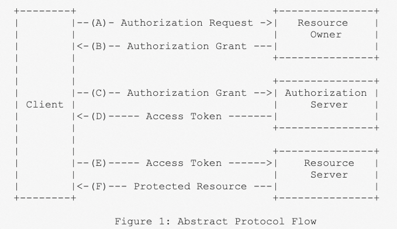
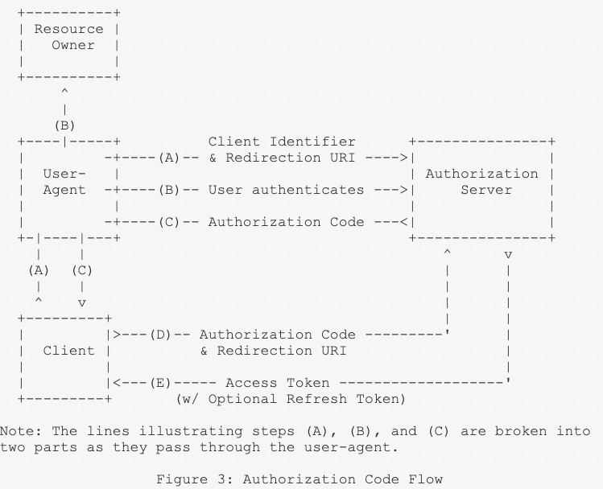
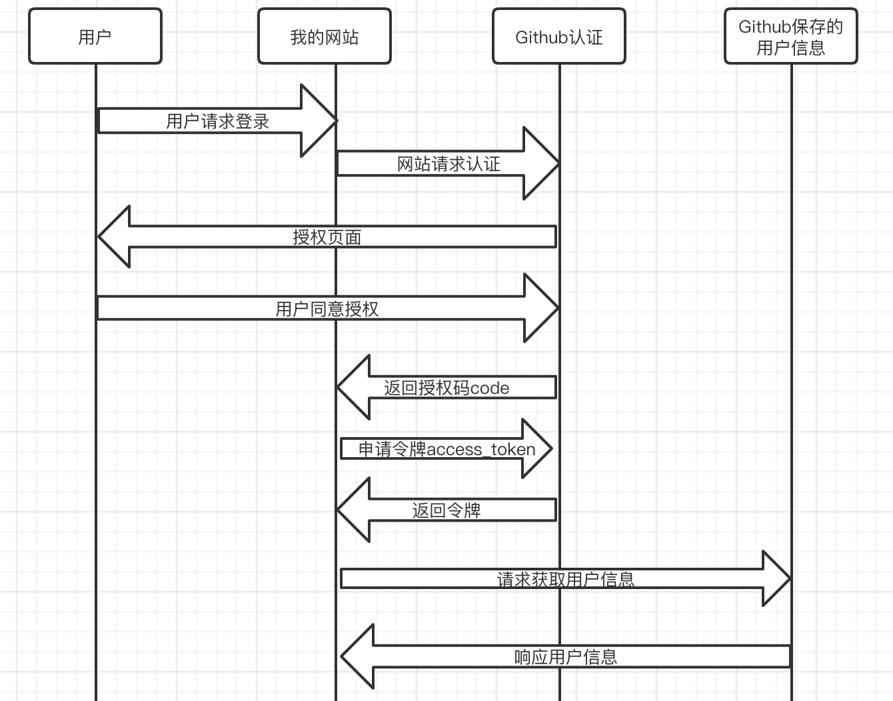
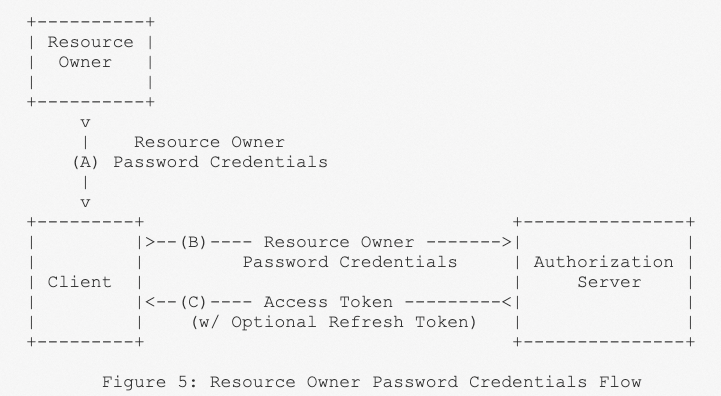

[TOC]

#### OAuth2.0 是什么？

OAuth2.0是一个关于授权（authorization）的开放标准，允许用户授权第三方应用访问他们存储在另外的服务提供者上的信息，而不需要将用户名和密码提供给第三方应用或分享他们数据的所有内容。

#### 一个场景说明

比如我有一个个人网站，你看完了一遍文章，想给我留言，现在你面临两种选择：

1：在我的网站上注册拥有一个新用户，然后用注册的用户名来留言

2：一个是使用Github账号登录，使用你的GitHub账号来留言

第一种你可能会觉得过于繁琐（而且有的网站并不会提供登录注册的功能，比如一些没有账户体系的网站，相应的如果提供认证用户的功能，他肯定会提供某种机制来认证用户，此时GitHub授权登录就是一种方法），于是你点击了授权GitHub来登录，此时OAuth 2.0授权就开始了。。。

#### OAuth的思路

OAuth在客户端和服务提供商之间，设置了一个授权层。客户端不能直接登录服务提供商，只能登录授权层，以此将用户与客户端区分开来。客户端登录授权层所用的令牌，与用户的密码不同。用户在登录的时候，制订授权层令牌的权限范围和有效期。

客户端登录授权层以后，服务提供商根据令牌的权限范围和有效期，向客户端开放用户存储的资料（比如简单个人信息之类）

#### 协议流程



先对上面这幅图进行解释：

1、Client（客户端）

本身不存储资源，需要通过资源拥有者的授权去请求资源服务器的资源。比如：Android客户端、Web客户端（浏览器端）等

2、Resource Owner（资源拥有者）

通常为用户，也可以是应用程序，即该资源的拥有者

3、Authorization Server（授权服务器）

用于服务提供商对资源拥有的身份进行认证、对访问资源进行授权，认证成功后会给客户端颁发令牌（access_token）

4、Resource Server（资源服务器）

存储资源的服务器，有时候授权服务器和资源服务器是同一个

流程是这样：

(A) 用户打开客户端后，客户端要求用户给予授权。

(B) 用户同意给予客户端授权

(C) 客户端使用上一步获得的授权，想认证服务器申请令牌

(D) 认证服务器对客户端进行认证以后，确认无误，同意发放令牌

(E) 客户端使用令牌，向资源服务器申请获取资源

(F) 资源服务器确认令牌无误，同意向客户端开放资源

上面6个步骤中，B是关键，即用户怎样才能给客户端授权？有了这个授权以后，客户端可以获取令牌，进而凭令牌获取资源。

#### 客户端的授权模式

客户端必须得到用户的授权（authorization grant），才能获取令牌（access token）。OAuth 2.0定义了四种授权方式。

- 授权码模式（authorization code）
- 简化模式（implicit）
- 密码模式（Resource Owner Password Credentials）
- 客户端模式（Client Credentials）

#### 授权码模式

授权码模式是功能最完整、流程最严密的授权模式。他的特点就是通过客户端的后台服务器，与服务提供商的认证服务器进行互动



首先这个图先简单的记录下每一步在干什么：

(A) 用户打开客户端后，客户端将用户导向认证服务器

(B) 用户选择给予客户端授权

(C) 如果用户给予授权，认证服务器将用户导向客户端事先指定的"重定向URL"中，同时附上一个授权码

(D) 客户端收到授权码，附上早先的"重定向URI"，向认证服务器申请令牌。这一步是在客户端的后台的服务器上完成的，对用户不可见

(E) 客户端使用令牌，向资源服务器申请获取资源

(F) 认证服务器核对了授权码和重定向URI，确认无误后，向客户端发送访问令牌（access token）和更新令牌（refresh token）

看起来还是有点绕，下面我将以一个实际的例子（还是以上面登录我的网站需要评论请求Github授权为例）来描述走通整个流程：

有一点需要说一下，即使用户刚才在浏览器上登录过GitHub，那也不能随便一个请求就能够拿到用户的访客信息，这不安全。所以我的网站必须和GitHub有一个协商。

##### 网站和GitHub的协商

GitHub会对他所拥有的用户做一个权限划分，什么信息是可以返回给授权过的网站的。比如写入或者读取用户基本信息，这个时候，GitHub会要求需要被授权的网站去申请，然后会给这个网站颁发一个clientID和ClientSecret。这个我们就可以将它看成是一个门票。

##### 用户和GitHub之间的协商

用户要点击GitHub进行授权了，他需要携带这些参数：

1. response_type：表示授权类型，必选项，此处的值固定为"code"
2. client_id：表示客户端的ID，必选项
3. redirect_uri：表示重定向URI，可选项
4. scope：表示申请的权限范围，可选项
5. state：表示客户端的当前状态，可以指定任意值，认证服务器会原封不动地返回这个值。

那么此时这个请求就是这样的：

```
GET /authorize?response_type=code&client_id=s6BhdRkqt3&state=xyz&redirect_uri=https%3A%2F%2Fclient%2Eexample%2Ecom%2Fcb HTTP/1.1
host: https://github.com/login/oauth/authorize
```

如果这个时候用户觉得我这个网站需要的权限太多，或者不想让我知道他的这个信息，总之就是用户选择了拒绝，那么整个OAuth2.0的授权流程就此结束了，认证也失败了。如果觉得觉得ok，点了确认授权，这个时候页面就会跳转到上面所说的redirect_uri所指向的页面，并且会附带一个code，这个code就是授权码认证模式的重点。

```
Location: http://my-website.com?code=xxx&state=xyz
state参数我们可以先不用注意，认证服务器会返回这个值，然后带上就好了
```

走到这一步的时候，这个用户和GitHub的协商就已经完成了，GitHub会记录这次协商，表示该用户已经允许在我的网站上访问用户所允许的那部分资源信息。

##### 我的网站去拜访GitHub

接下来我的网站就要告诉GitHub我要来访问了（请求GitHub允许我请求的用户的那部分信息）

上面说了GitHub会返回一个code，这个时候我只拿这个code去请求肯定不行，因为任何人都有可能会有这个code，这个时候就需要第一次协商时候办法的ClientSecret来起作用了。此时请求是这样的：

```
// 网站和 github 之间的协商，因为到这一步我就是要请求最后的绿卡（access_token）
POST https://github.com/login/oauth/access_token

// 协商凭证包括 github 给用户盖的章和 github 发给我的门票
params = {
	grant_type: authorization_code,
  code: "xxx",
  client_id: "xxx",
  client_secret: "xxx",
  redirect_uri: "http://my-website.com"
}
```

这个时候我拿着code，能够标识个人身份的 client_id、client_secret，访问GitHub得到了返回的access_token，如下

```
HTTP/1.1 200 OK
     Content-Type: application/json;charset=UTF-8
     Cache-Control: no-store
     Pragma: no-cache

     {
       "access_token":"2YotnFZFEjr1zCsicMWpAA",
       "token_type":"bearer",
       "expires_in":3600,
       "refresh_token":"tGzv3JOkF0XG5Qx2TlKWIA",
       "example_parameter":"example_value"
     }
```

##### 拿到最后的绿卡

好了，我得到了最终的绿卡（access_token），后面我要请求什么就变成这样了，比如我要请求用户的基本信息

```
// 访问用户数据
GET https://api.github.com/user
?access_token=e72e16c7e42f292c6912e7710c838347ae178b4a
```

那么，到此，整个OAuth2.0授权流程也走完了。

总结一下这个流程：

客户端（我的这个网站）请求第三方授权（GitHub），第三方同意给客户端授权，并返回一个code（授权码）

客户端获取到授权码（去GitHub请求的授权码），这个过程用户是看不到的

第三方向客户端响应令牌（access_token），这个过程用户是看不到的

客户端携带这个令牌去资源服务器（也就是这里的第三方）请求用户的基本信息

具体的详细流程如下：


##### 适用场景

安全性高，使用率高，流程复杂。要求第三方应用必须有服务器。对安全性要求较高，web项目中一般使用授权码模式

#### 密码模式

密码模式（Resource Owner Password Credentials Grant）中，用户向客户端提供自己的用户名和密码。客户端使用这些信息，向"服务商提供商"索要授权。


##### 它的步骤

（A）用户向客户端提供用户名和密码。

（B）客户端将用户名和密码发给认证服务器，向后者请求令牌。

（C）认证服务器确认无误后，向客户端提供访问令牌。

B步骤中，客户端发出的HTTP请求，包含以下参数：

- grant_type：表示授权类型，此处的值固定为"password"，必选项。
- username：表示用户名，必选项。
- password：表示用户的密码，必选项。
- scope：表示权限范围，可选项

##### 请求示例

```json
127.0.0.1:9999/oauth/token?grant_type=password&username=admin&password=123456&login_type=admin_type&client_id=api&client_secret=secret

{
    "access_token": "21197124-8162-4311-9d5e-6f9c60639a6e",
    "token_type": "bearer",
    "expires_in": 42590,
    "scope": "all"
}
```

##### 使用场景

在这种模式中，用户必须把自己的密码给客户端，但是客户端不得储存密码。这通常用在用户对客户端高度信任的情况下，比如客户端是操作系统的一部分，或者由一个著名公司出品。而认证服务器只有在其他授权模式无法执行的情况下，才能考虑使用这种模式

#### 客户端模式

客户端模式不常用，简单介绍下：

客户端模式（Client Credentials Grant）指客户端以自己的名义，而不是以用户的名义，向"服务提供商"进行认证。严格地说，客户端模式并不属于OAuth框架所要解决的问题。在这种模式中，用户直接向客户端注册，客户端以自己的名义要求"服务提供商"提供服务，其实不存在授权问题。

#### 简化模式

简化模式不常用，简单介绍下：

简化模式（implicit grant type）不通过第三方应用程序的服务器，直接在浏览器中向认证服务器申请令牌，跳过了"授权码"这个步骤，因此得名。所有步骤在浏览器中完成，令牌对访问者是可见的，且客户端不需要认证。