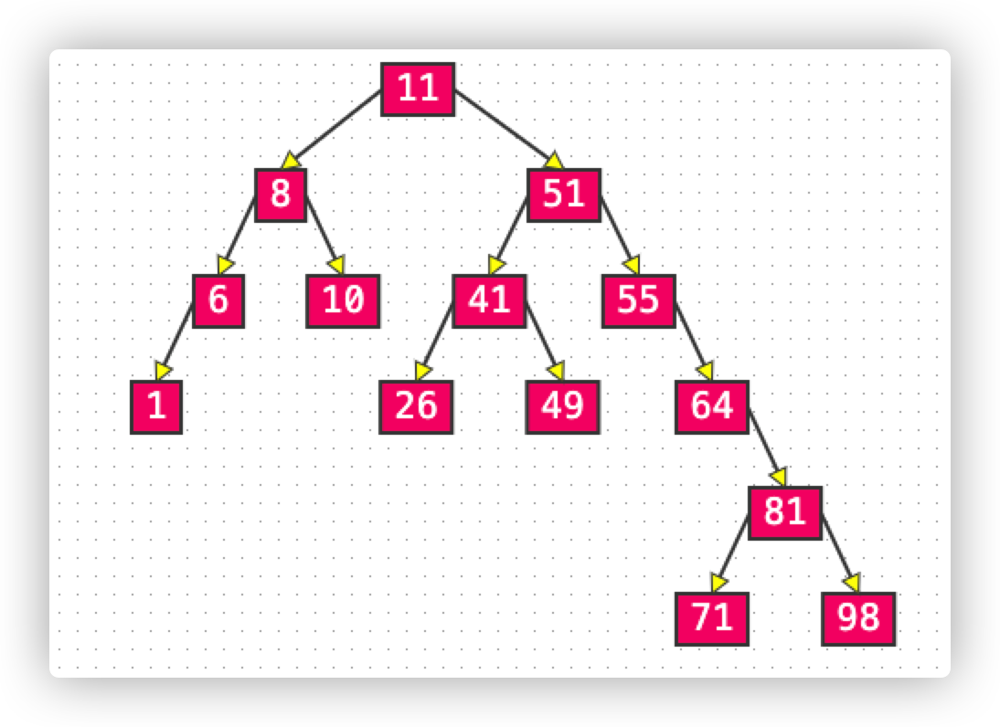
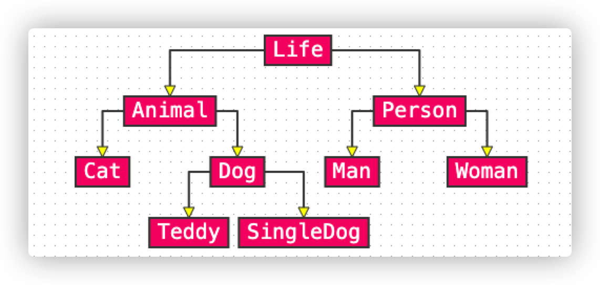
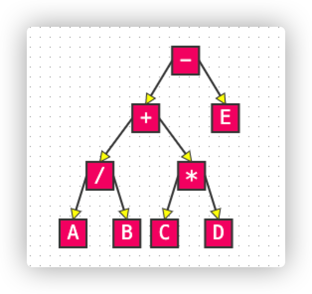

#### 一、树（Tree）的基本概念：

- 节点、根节点、父节点、子节点、兄弟节点
- 一棵树可以没有任何节点，称为空树
- 一棵树也可以只有一个节点，也就是根节点
- 子树、左子树、右子树
- 节点的度（degree）：子树的个数
- 树的度：所有节点度中的最大值
- 叶子节点（leaf）：度为0的节点
- 非叶子节点：度不为0的节点
- 层数（level）：根节点在第1层，根节点的子节点在第2层，以此类推（有些说法也从第0层开始说起）
- 节点的深度（depth）：从根节点到当前节点的唯一路径上的节点总数
- 节点的高度（heigth）：从当前节点到最远叶子节点的路径上的节点总数
- 树的深度：所有节点深度中的最大值
- 树的高度：所有节点高度中的最大值（树的深度等于树的高度）
- 有序树：树中任意节点的子节点之间有顺序关系
- 无序树：树中任意节点的子节点之间没有顺序关系，也称“自由树”
- 森林：由m(m>=0)棵互不相交的树组成的集合

#### 二、二叉树（Binary Tree）

##### 1、二叉树的特点

- 每个节点的度最大为2（最多拥有2棵子树）
- 左子树和右子树是有顺序的
- 即使某节点只有一颗子树，也要区分左右子树
- 二叉树是有序树

##### 2、二叉树的性质

- 非空二叉树的第i层，最多有2i-1个（i>=1）
- 在高度为h的二叉树上最多有2h-1个节点（h>=1）
- 对于任何一棵非空二叉树，如果叶子节点个数为n0，度为2的节点个数为n2，则有：n0 = n2 + 1
  - 假设度为1的节点个数为n1，那么二叉树的节点总数 n = n0 + n1 + n2
  - 二叉树的边树 T = n1 + 2 * n2 = n - 1 = n0 + n1 +n2 - 1
  - 因此可以得出 n0 = n2 + 1

##### 3、真二叉树（Proper Binary Tree）

所有节点的度要么为0，要么为2

##### 4、满二叉树（Full Binary Tree）

最后一层节点的度都为0，其他节点的度都为2

假设满二叉树的高度为h（h>=1），那么有

- 第i层的节点数量：2i-1
- 叶子节点数量：2h-1
- 总节点数量n：
  - n=2h-1=20+21+22+...+2h-1
  - h=log2(n+1)
- 在同样高度的二叉树中，满二叉树的叶子节点数量最多，总节点数量最多
- 满二叉树一定是真二叉树，真二叉树不一定是满二叉树

##### 5、完全二叉树（Complete Binary tree）

对节点从上至下、从左至右开始编号，其所有编号都能与相同高度的满二叉树中的编号对应

- 叶子节点只会出现最后2层，最后1层的叶子节点都靠左对齐
- 完全二拆树从二叉树至倒数第2层树是一棵满二叉树
- 度为1的节点只有左子树
- 度为1的节点要么是1个，要么是0个
- 同样节点数量的二叉树，完全二叉树的高度最小
- 假设完全二叉树的高度为h（h>=1）,那么有：
  - 至少有2h-1个节点（20+21+22+...+2h-2+1）
  - 最多有2h-1个节点（20+21+22+...+2h-1，满二叉树）
  - 总节点数量为n:
    - 2h-1 <= n <= 2h
    - h-1 <= log2n < h
    - h = floor(log2n)+1
    - 注意：floor 是向下取整，ceiling 是向上取整
- 完全二叉树的性质还有很多，这里暂不一一列举。

##### 6、关于二叉树的一些叫法

Full Binary Tree：完满二叉树（所有非叶子节点的度都为2，也就是国内所说的“真二叉树”）

Perfect Binary Tree：完美二叉树（所有非叶子节点的度都为2，且所有的叶子节点都在最后一层）

Complete Binary Tree：完全二叉树（和国内一样）

#### 三、二叉树的遍历

遍历是数据结构中的常见操作（把所有元素都访问一遍）

线性数据结构的遍历比较简单（正序遍历、逆序遍历）

根据节点访问顺序的不同，二叉树的常见遍历方式有4种

- 前序遍历（Preorder Traversal）
- 中序遍历（Inorder Traversal）
- 后序遍历（Postorder Traversal）
- 层序遍历（Level Order Traversal）

##### 1、前序遍历

访问顺序：根节点、前序遍历左子树、前序遍历右子树

结果：Life, Animal, Cat, Dog, Teddy, SingleDog, Person, Man, Woman

应用：树状结构展示（注意左右子树的顺序）

##### 2、中序遍历

访问顺序：中序遍历左子树、根节点、中序遍历右子树

结果：Cat, Animal, Teddy, Dog, SingleDog, Life, Man, Person, Woman

应用：二叉搜索树的中序遍历按升序或者降序处理节点

##### 3、后序遍历

访问顺序：后序遍历左子树、后序遍历右子树、根节点

结果：Cat, Teddy, SingleDog, Dog, Animal, Man, Woman, Person, Life

应用：适用于一些先子后父的操作

##### 4、层序遍历

访问顺序：从上到下、从左到右依次问每一个节点

结果：Life, Animal, Person, Cat, Dog, Man, Woman, Teddy, SingleDog

应用：1、计算二叉树的高度。2、判断一棵树是否为完全二叉树

#### 四、四则运算

为什么会提起这个，因为在树这个结构中我们发现如果将一个**加减乘除**的运算符作为父节点，将操作数作为叶子节点，就会有这样的现象：

首先四则运算的表达式可以分为三种： 

| 前缀表达式（prefix expression）[波兰表达式] | 中缀表达式（infix exp） | 后缀表达式（postfix expr）[逆波兰表达式] |
| :-----------------------------------------: | :---------------------: | :--------------------------------------: |
|                    + 1 2                    |          1+ 2           |                  1 2 +                   |
|                  + 2 * 3 4                  |        2 + 3 * 4        |                2 3 4 * +                 |
|                + 9 * - 4 1 2                |   9 + （ 4 - 1 ） * 2   |              9 4 1 - 2 * +               |

我们观察这一棵二叉树，发现如果我们使用前序遍历，其结果刚好是前缀表达式（-, +, /, A, B, *, C, D, E）

如果是中序遍历，其结果刚好是中缀表达式（A, /, B, +, C, *, D, -, E）

如果是后序遍历，其结果刚好是后缀表达式（A, B, /, C, D, *, +, E, -）

