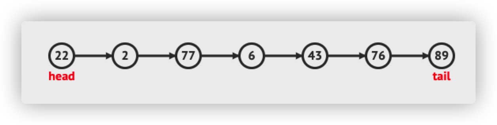

动态数组有个明显的缺点：可能会造成内存空间的大量浪费，能否用到多少就申请多少内存？链表可以做到

### 一、链表（LinkedList）

- 链表是一种`链式存储`的线性表，所有元素的内存地址不一定是连续的。



- head:头节点

- tail:尾节点

- 每一个 node 节点里面都含有一个指向下一个 node 节点的指针

### 二、接口设计

- 创建LinkedList类，管理链表数据，其中的size属性记录存储数据的数量，first属性引用链表的第0个元素。
- 创建私有类Node，其实element属性用于存储元素，next属性用于指向链表的下一个节点。

```java
public class LinkedList<E> {
    private int size;
    private Node<E> first;
    
    // 元素的数量
    int size(); 
    // 是否为空
    boolean isEmpty();
    // 是否包含某个元素
    boolean contains(E element); 
    // 添加元素到最后面
    void add(E element); 
    // 返回index位置对应的元素
    E get(int index); 
    // 设置index位置的元素
    E set(int index, E element); 
    // 往index位置添加元素
    void add(int index, E element); 
    // 删除index位置对应的元素 
    E remove(int index); 
    // 查看元素的位置
    int indexOf(E element); 
    // 清除所有元素
    void clear();
    
    // 私有类, 链表中的节点
    private class Node<E> {
        E element;
        Node<E> next;
        // 构造方法
        public Node(E element, Node<E> next) {
            this.element = element;
            this.next = next;
        }
    }
}
```

### 三、链表的实现

##### 1、构造方法

- 链表的创建与动态数组不同，动态数组在构造时需要传入一个空间属性，来决定这个数组的容量。但链表元素是在添加时才创建的，内存地址不一定是连续的。所以链表不需要单独设计构造方法，使用默认构造方法即可。

##### 2、添加元素

- 添加元素时，需要创建一个节点存储数据，并将该记节点拼接到最后节点的后面，然后`size+1`
- 需要区分，当前链表没有数据，新节点拼接到first和当前链表有数据，新节点拼接到最后的节点

```java
public void add(E element) {
    // 当first等于null时, 说明此事没有节点, 所以first引用新节点
    if (first == null) {
    	first = new Node<E>(element, null);
    }
    // 当fitst不等于null时, 说明链表中有节点, 此时获取最后一个节点, 并将该节点的next指向新节点
    else {
        Node<E> node = node(size - 1);
        node.next = new Node<E>(element, null);
    }
    size++;
}
```

##### 3、插入元素

- 插入链表，首先需要创建新节点，然后通过变更插入位置前一个元素next指针指向插入的这个节点，然后把这个节点的next指针指向插入位置的下一个节点即可。

- 需要区分插入到0的位置，使用first指针指向新的节点和插入到非0位置，找到前一个节点进行处理两种情况。

  ```java
  public void add(int index, E element) {
      // 检查索引是否越界,健壮性校验
      rangeCheckForSize(index);
      // 当插入到0的位置时
      if (index == 0) {
          // 将first指向新节点, 新节点的next指向first之前指向的节点
          first = new Node<E>(element, first.next);
      }else {
          // 找到指定位置前面的节点
          Node<E> prev = node(index - 1);
          // 将前面节点的next指向新节点, 新节点的next指向prev之前指向的节点
          prev.next = new Node<>(element, prev.next);
      }
      size++;
  }
  ```

##### 4、删除元素

- 首先找到删除的节点（delete_node）的前一个节点（pre_node），然后通过变更（pre_node）节点的 next 指针指向删除节点（delete_node）的下一个节点即可，然后size-1

- 需要注意的一点是：如果删除的是第0个元素，则 first 指向第1个节点


  ```java
  public E remove(int index) {
      // 检查索引是否越界
      rangeCheck(index);
      // 记录需要删除的节点
      Node<E> old = first;
      // 当删除第0个元素时, 将first的next指向索引为`1`的节点即可
      if (index == 0) {
          first = first.next;
      }else {
          // 找到前一个元素
          Node<E> prev = node(index - 1);
          // 记录需要删除的节点
          old = prev.next;
          // 将prev的next指向需要删除节点的后一个节点
          prev.next = old.next;
      }
      // size-1
      size--;
      // 返回删除的元素
      return old.element;
  }
  ```

##### 5、清空元素

- 将first指向null,释放链表所有node,同时size置为0即可。

  ```java
  public void clear() {
      first = null;
      size = 0;
  }
  ```

##### 6、修改元素

- 首先通过遍历链表元素，找到该节点

  ```java
  private Node<E> node(int index) {
      //越界判断
      rangeCheck(index);
  		
      Node<E> node = first;
          for (int i = 0; i < index; i++) {
              node = node.next;
          }
      return node;
  }
  ```

- 然后修改node节点的element即可

  ```java
  public E set(int index, E element) {
      // 找到对应节点, node方法中已经判断了索引是否越界
      Node<E> node = node(index);
      // 记录旧元素
      E old = node.element;
      // 覆盖元素
      node.element = element;
      // 返回旧元素
      return old;
  }
  ```

##### 7、查找元素

- 找到对应的节点，取出元素即可。

  ```java
  public E get(int index) {
      // node方法中已经判断了索引是否越界
      return node(index).element;
  }
  ```

##### 8、查找元素的索引

- 查找指定元素的索引，需要遍历所有节点，找到节点对应的元素与执行元素相等即可

- 如果需要查找的元素element为null，则需要分两种情况处理

  ```java
  private static final int ELEMENT_ON_FOUND = -1;
  public int indexOf(E element) {
      // 取出头结点
      Node<E> node = first;
      // 当element为null时的处理
      if (element == null) {
          // 遍历节点, 找到存储为null的节点, 返回索引
          for (int i = 0; i < size; i++) {
              if (node.element == null) return i;
              node = node.next;
          }
      }else {
          for (int i = 0; i < size; i++) {
              // 遍历节点, 找到存储的元素与指定元素相等的节点, 返回索引
              if (element.equals(node.element)) return i;
              node = node.next;
          }
      }
      // 没有找到元素对应的节点, 返回ELEMENT_ON_FOUND
      return ELEMENT_ON_FOUND;
   }
  ```

##### 9、获取链表元素存储元素的个数

- 就是size的值，return size即可

##### 10、链表是否为否

- 就是判断size是否为0，return size==0即可

##### 11、元素是否存在

- 就是判断元素的索引是否为ELEMENT_ON_FOUND，**return** indexOf(element) != ELEMENT_ON_FOUND即可

##### 12、打印链表中存储的数据

```java
public String toString() {
    StringBuilder string = new StringBuilder();
    string.append("size = ").append(size).append(", [");
    Node<E> node = first;
    for (int i = 0; i < size; i++) {
        if (i != 0) {
            string.append(",");
        }
        string.append(node.element);
        node = node.next;
    }
    string.append("]");
    return string.toString();
}
```

### 四、链表的复杂度

|                          | 动态数组                       | 链表                           |
| ------------------------ | ------------------------------ | ------------------------------ |
| add(int index,E element) | 最好O(1)、最坏O(n)、`平均O(n)` | 最好O(1)、最坏O(n)、`平均O(n)` |
| remove(int index)        | 最好O(1)、最坏O(n)、`平均O(n)` | 最好O(1)、最坏O(n)、`平均O(n)` |
| set(int index,E element) | 最好O(1)、最坏O(1)、`平均O(1)` | 最好O(1)、最坏O(n)、`平均O(n)` |
| get(int index)           | 最好O(1)、最坏O(1)、`平均O(n)` | 最好O(1)、最坏O(n)、`平均O(n)` |


