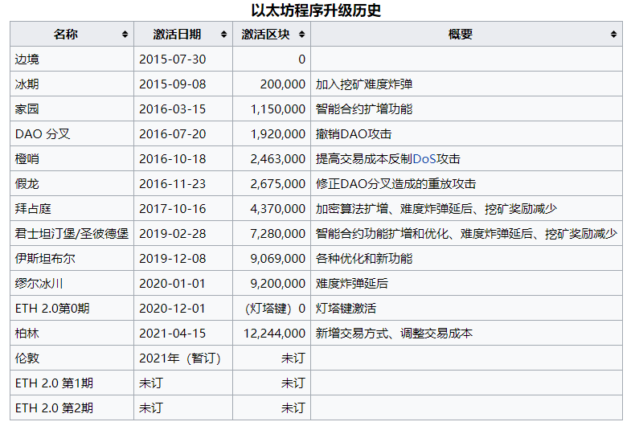
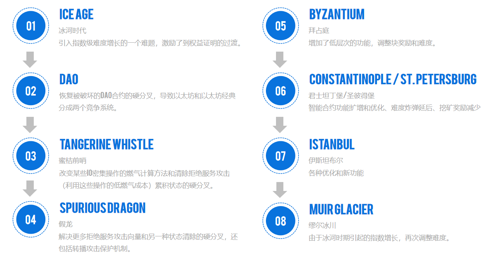
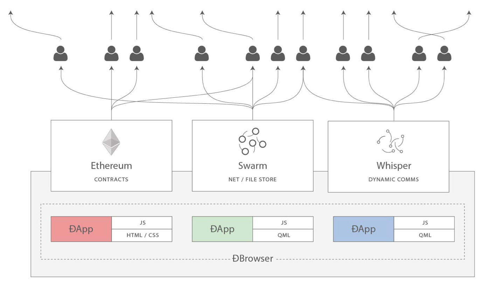

- [什么是以太坊](#什么是以太坊)
  - [与比特币的比较](#与比特币的比较)
  - [区块链的组件](#区块链的组件)
  - [以太坊的诞生](#以太坊的诞生)
  - [以太坊开发的四个阶段](#以太坊开发的四个阶段)
    - [Frontier 边境](#frontier-边境)
    - [Homestead 家园](#homestead-家园)
    - [Metropolis 都会](#metropolis-都会)
    - [Serenity 宁静](#serenity-宁静)
    - [硬分叉](#硬分叉)
  - [以太坊：通用的区块链](#以太坊通用的区块链)
  - [以太坊的组件](#以太坊的组件)
    - [P2P Network](#p2p-network)
    - [Consensus rules](#consensus-rules)
    - [Transactions](#transactions)
    - [State Machine](#state-machine)
    - [Blockchain](#blockchain)
    - [Consensus Algorithm](#consensus-algorithm)
    - [Clients](#clients)
  - [以太坊和图灵完整性](#以太坊和图灵完整性)
    - [图灵完备是一个“特性”](#图灵完备是一个特性)
    - [图灵完备的含义](#图灵完备的含义)
  - [从通用区块链到去中心化应用 (DApps)](#从通用区块链到去中心化应用-dapps)
  - [万维网的进化](#万维网的进化)
  - [以太坊的开发文化](#以太坊的开发文化)

# 什么是以太坊

以太网是“世界的计算机”。

从计算机科学的角度来说，以太坊是一种确定性但实际上无界的状态机，它有两个基本功能，第一个是全局可访问的单例状态，第二个是对状态进行更改的虚拟机。

从更实际的角度来说，以太坊是一个开源的，全球的去中心化计算架构，执行成为 智能合约 的程序。它使用区块链来从同步和存储系统 状态，以及称为 ether 的加密货币来计量和约束执行资源成本。

以太坊平台使开发人员能够利用内置的经济学方法构建强大的去中心化应用程序。在保证持续正常运行时间的同时，还可以减少或消除审查机构，第三方接口和对手方风险。

## 与比特币的比较

在许多方面，以太坊的目的和结构都与之前的开放区块链（包括比特币）截然不同。

以太坊的主要目的不是成为数字货币支付网络。虽然数字货币以太币是以太坊运营不可或缺的一部分，但以太币的目的是作为一种实用货币，用于支付使用以太坊平台作为世界计算机的费用。

与脚本语言非常有限的比特币不同，以太坊被设计成一个通用的可编程区块链，它运行一个能够执行任意和无限复杂性代码的虚拟机。比特币的脚本语言有意限制为对支出条件进行简单的真/假评估，而以太坊的语言是图灵完备的，这意味着以太坊可以直接用作通用计算机。

## 区块链的组件

开源、公开的区块链通常包括以下组件：

* 一个连接参与者，并传播交易和包含已验证交易的区块的点对点网络，基于标准的“gossip“协议。

* 状态机中实现的一系列共识规则。

* 消息，以交易的形式表示，代表状态转移。

* 根据共识规则处理交易的状态机。

* 分布式数据库，区块链，记录所有状态转移的日志。

* 共识算法（例如，Proof-of-Work），通过强制参与者竞争并使用共识规则约束他们，来分散区块链的控制权。

* 上述内容的一个或多个开源软件实现。

所有或大部分这些组件通常组合在一个软件客户端中。

## 以太坊的诞生

所有伟大的创新都解决了真正的问题，以太坊也不例外。

当人们认识到比特币模型的力量，并试图超越加密货币应用，转向其他项目时，人们构思出了以太坊。但开发人员面临着一个难题：要么在比特币之上构建，要么启动一个新的区块链。
以比特币为基础意味着处于网络的有意约束之中，并试图找到解决方法。数据存储的有限类型和大小似乎限制了可以在其上作为第二层解决方案运行的应用程序的类型。程序员需要构建仅使用有限的变量，交易类型和数据集的系统。
对于需要更多自由度和更大灵活性的项目，启动新的区块链是唯一的选择。

2013年底，年轻程序员和比特币爱好者Vitalik Buterin开始考虑进一步扩展比特币和Mastercoin（一种扩展比特币，提供基本智能合约的叠加协议）的功能。 2013年10月，Vitalik向Mastercoin团队提出了一个更通用的方法，该方案允许用灵活且可编写脚本（但不是图灵完备的）的合约取代Mastercoin的专业合约语言。虽然Mastercoin团队印象深刻，但这一提议太过激进，无法适应他们的发展路线图。

2013年12月，Vitalik开始分享一份白皮书，描述了以太坊背后的想法：一个图灵完备的可编程和通用区块链。

本书的两位作者：Andreas M. Antonopoulos 非常关注以太坊的进展，但他正在写作“Mastering Bitcoin”一书的早期阶段，直到很久以后才直接参与以太坊。然而，Gavin Wood博士是第一批接触Vitalik并提供帮助提供C ++编程技能的人员之一。Gavin成为了以太坊的联合创始人，联合设计师和CTO。

以太坊的创始人们正在考虑一个并非针对特定目的的区块链，而是通过成为可编程的来支持各种各样的应用。这个想法是，通过使用像以太坊这样的通用区块链，开发人员可以编写他们的特定应用程序，而不必开发对等网络，区块链，共识算法等底层机制。以太坊平台旨在抽象这些详细信息并为去中心化区块链应用程序提供确定性和安全的编程环境。

2015年7月30日，第一个以太坊地块被开采。世界计算机开始为世界服务。

## 以太坊开发的四个阶段

以太坊的诞生是第一阶段的启动，名为“前沿（Frontier）”。以太坊的发展计划分四个阶段进行，每个新阶段都会发生重大变化。每个阶段都可能包含子版本，称为“硬分叉”，它们以不向后兼容的方式改变功能。

四个主要的发展阶段代号为前沿（Frontier），家园（Homestead），大都会（Metropolis）和宁静（Serenity）。中间的硬分叉代号为“冰河时代（Ice Age）”，“DAO”，“蜜桔前哨（Tangerine Whistle）”，“假龙（Spurious Dragon）”，“拜占庭（Byzantium）”和“君士坦丁堡（Constantinople）”。

### Frontier 边境

以太坊的公共区块链在2015年7月30日引导，最初的版本称为“边境”，用的是工作量证明（proof-of-work）的算法，但未来预期会转换成权益证明（proof-of-stake）。激活后不久进行了第一次分叉，调整未来挖矿的难度，确保未来的用户会有转换至权益证明的动机。边境最初只能挖矿，主要功能是让用户有时间加入以太链，过了几天后才能交易和使用智能合约。

### Homestead 家园

2016年春季进行了第二次分叉，发布了第一个稳定版本，称作“家园”（Homestead）。

2016年六月，以太坊上的一个去中心化自治组织 The DAO 被骇，造成市值五千万美元的以太币被移动到只有该黑客可以控制的“分身DAO”。因为程序不允许黑客立即提取这些以太币，以太坊用户有时间讨论如何处理此事，考虑的方案包括取回以太币和关闭DAO，而DAO去中心化的本质也表示没有中央权力可以立即反应，而需要用户的共识。最后在2016年7月20日，以太坊进行硬分叉，作出一个向后不兼容的改变，让所有的以太币（包括被移动的）回归原处，而不接受此改变的区块链则成为以太坊经典。

### Metropolis 都会

“都会”的开发遇到许多延迟，升级分成了三次分叉，2017年10月的“拜占庭”、2019年2月的“君士坦丁堡”和“圣彼德堡”、以及2019年12月的“伊斯坦布尔”。这些升级主要改善智能合约的编写、提高安全性、加入难度炸弹以及一些核心架构的修改，以协助未来从工作量证明转至权益证明。安全性升级包括让以太坊可以使用零知识证明的zk-SNARKs和zk-STARKs，也能和Zcash链互通。

### Serenity 宁静

“宁静”又称为“以太坊2.0”，是项目的最终阶段，将转至权益证明，并开发第二层扩容方案。目前预计分成三次分叉：柏林、伦敦、以及未命名的第三次分叉。

“柏林”原定于2020年6月推出，后来延迟至11月进行。测试链至2020年8月才推出，并在测试中发现了一些错误。后来权益证明所需的灯塔链在12月1日上线，柏林程序分叉在2021年四月上线。

### 硬分叉

## 以太坊：通用的区块链

原始区块链（比特币的区块链）追踪比特币单位的状态及其所有权。你可以将比特币视为分布式共识 状态机，其中交易引起全局的状态转移 ，从而更改比特币的所有权。状态转移受共识规则的制约，允许所有参与者（最终）在开采数个区块后在系统的共同（共识）状态上汇合。

以太坊也是一个分布式状态机。但是，不仅仅追踪货币所有权的状态，以太坊追踪通用数据存储的状态转换。通常我们指的是任何可以表示为键值对key-value tuple的数据。
在某些方面，这与通用计算机使用的 Random访问存储器（RAM） 的数据存储模型具有相同的用途。以太坊有 memory 存储代码和数据，它使用以太坊区块链来跟踪这些内存随着时间的变化。就像通用的存储程序的计算机一样，以太坊可以将代码加载到其状态机中并运行该代码，将结果状态更改存储在其区块链中。与通用计算机的两个重要差异在于，以太坊状态的变化受共识规则的支配，并且状态通过共享账本全球分布。

## 以太坊的组件

### P2P Network

以太坊在以太坊主网上运行，可以通过TCP端口30303访问，运行称作 ÐΞVp2p 的协议。

### Consensus rules

以太坊的共识规则，在参考规范，即 [yellowpaper] 中定义。

### Transactions

Ethereum交易是网络消息，包括发送者，接收者，值和数据负载等。

###  State Machine

以太坊的状态转移由 Ethereum虚拟机（EVM） 处理，这是一个执行 bytecode（机器语言指令）的基于栈的虚拟机。称为“智能合约”的EVM程序以高级语言（如Solidity）编写，并编译为字节码以便在EVM上执行。

### Blockchain

以太坊的区块链作为 database（通常是Google的LevelDB）存储在每个节点上，该区块链在称作 梅克尔帕特里夏树 Merkle Patricia Tree 的序列化哈希数据结构中包含交易和系统状态，。

### Consensus Algorithm

以太坊目前使用名为_Ethash_的工作量证明算法，但有计划在不久的将来将过渡到称为_Casper_的权益证明（Proof-of-Stake）系统。

### Clients

以太坊有几个可互操作的客户端软件实现，其中最突出的是 Go-Ethereum（Geth）_和_Parity。

## 以太坊和图灵完整性

以太坊在一个名为以太坊虚拟机的状态机中执行存储程序，在内存中读写数据的能力，使其成为一个图灵完整系统，因此是一台通用图灵机。对于有限的存储，以太坊可以计算任何图灵机可以计算的算法。

以太坊的突破性创新是将存储程序计算机的通用计算架构与去中心化区块链相结合，从而创建分布式单状态（单例）世界计算机。以太坊程序“到处”运行，但却产生了共识规则所保证的共同（共识）状态。

### 图灵完备是一个“特性”

图灵完备不仅可以最简单的系统中实现，而且有意设计为受限制的图灵不完备的系统通常被认为是“意外图灵完备的”。图灵不完备的约束系统更难设计，必须仔细维护，以保持图灵不完备。

### 图灵完备的含义

图灵证明，你无法通过在计算机上模拟程序来预测程序是否会终止。

以太坊如何限制智能合约使用的资源？以太坊引入了称为燃气 gas的计量机制。随着EVM执行智能合约，它会仔细考虑每条指令（计算，数据访问等）。每条指令都有一个以燃气为单位的预定成本。当交易触发智能合约的执行时，它必须包含一定量的燃气，用以设定运行智能合约可消耗的计算上限。如果计算所消耗的燃气量超过交易中可用的天然气量，则EVM将终止执行。Gas是以太坊用于允许图灵完备计算的机制，同时限制任何程序可以使用的资源。

## 从通用区块链到去中心化应用 (DApps)

以太坊作为一种可用于各种用途的通用区块链的方式开始。但很快，以太坊的愿景扩展为编程 去中心化应用（DApps） 的平台。DApps代表比“智能合约”更广阔的视角。DApp至少是一个智能合约和一个web用户界面。更广泛地说，DApp是一个基于开放的，去中心化的，点对点基础架构服务的Web应用程序。

DApp至少由以下部分组成：

* 区块链上的智能合约

* 一个Web前端用户界面

另外，许多DApp还包括其他去中心化组件，例如：

* 去中心化（P2P）存储协议和平台。

* 去中心化（P2P）消息传递协议和平台。

## 万维网的进化

DApps的概念旨在将万维网引入其下一个自然演进，将去中心化对等协议引入Web应用程序的每个方面。用于描述这种演变的术语是 Web3，意思是网络的第三个“版本”。由Gavin Wood首先提出，web3代表了Web应用程序的新愿景和焦点：从集中拥有和管理的应用程序到基于去中心化协议的应用程序。

Ethereum + web3js + JavaScript库，它将你的浏览器中运行的JavaScript应用程序与以太坊区块链连接起来。web3.js 库还包含一个名为 Swarm 的P2P存储网络接口和一个称为 Whisper 的P2P消息传递服务。通过在你的Web浏览器中运行的JavaScript库中包含这三个组件，开发人员可以使用完整的应用程序开发套件来构建web3 DApps。

## 以太坊的开发文化

在比特币中，开发以保守原则为指导：所有变化都经过仔细研究，以确保现有系统都不会中断。大部分情况下，只有在向后兼容时才会执行更改。允许现有客户“选择加入”，但如果他们决定不升级，将继续运作。
相比之下，在以太坊中，开发文化的重点是速度和创新。这个咒语是“快速行动，解决事情”。如果需要进行更改，即使这意味着使之前的假设失效，破坏兼容性或强制客户端进行更新，也会执行更改。以太坊的开发文化的特点是快速创新，快速进化和愿意参与实验。在以太坊有很少的神圣原则，最终标准或固定接口。
