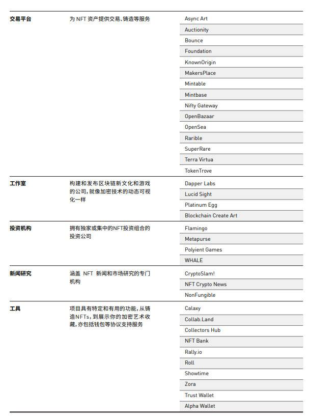

- [深度盘点 NFT 基础设施](#深度盘点-nft-基础设施)
- [底层公链](#底层公链)
  - [基础设施公链与侧链的探索之路](#基础设施公链与侧链的探索之路)
    - [比特币](#比特币)
    - [以太坊](#以太坊)
    - [Layer-2 拓展解决方案](#layer-2-拓展解决方案)
    - [Flow、NEAR 等新一代可扩展区块链](#flownear-等新一代可扩展区块链)
  - [建立基础设施面临的五大问题](#建立基础设施面临的五大问题)
    - [1. 环境成本](#1-环境成本)
    - [2. 缺乏监管](#2-缺乏监管)
    - [3. 复杂性](#3-复杂性)
    - [4. 速度慢](#4-速度慢)
    - [5. 传统机构的冲击](#5-传统机构的冲击)
  - [NFT 公链](#nft-公链)
    - [Flow](#flow)
      - [Flow 必知点](#flow-必知点)
      - [Flow 的运行机制](#flow-的运行机制)
      - [Flow 的四大优势](#flow-的四大优势)
      - [Flow 的投资者与合作伙伴](#flow-的投资者与合作伙伴)
      - [Flow 链背后开发团队——Dapper Labs](#flow-链背后开发团队dapper-labs)
    - [币安智能链 Binance Smart Chain，BSC](#币安智能链-binance-smart-chainbsc)
      - [开发原因](#开发原因)
      - [设计原则](#设计原则)
      - [跨链传输和通信](#跨链传输和通信)
      - [BSC 著名项目](#bsc-著名项目)
    - [NEAR 链](#near-链)
      - [去中心化网络](#去中心化网络)
      - [NEAR 代币](#near-代币)
      - [NEAR 的运行优点](#near-的运行优点)
      - [NEAR 团队](#near-团队)
      - [NEAR 的合作伙伴](#near-的合作伙伴)
  - [NFT主要侧链](#nft主要侧链)
    - [Polygon 侧链（Matic）](#polygon-侧链matic)
      - [Polygon 的优势](#polygon-的优势)
      - [Polygon 的理想形态](#polygon-的理想形态)
    - [Ronin](#ronin)
  - [未来展望](#未来展望)
- [协议层](#协议层)
  - [hardforksNFT 链上协议标准的统一](#hardforksnft-链上协议标准的统一)
  - [IOST 新协议标准](#iost-新协议标准)
  - [Flow NFT 代币标准](#flow-nft-代币标准)
  - [其他](#其他)
- [应用层](#应用层)

# 深度盘点 NFT 基础设施

根据技术架构划分， NFT 产业生态基础设施多集中于以下三方向：

* 数据结算层的各大底层公链；
* 协议层各类技术标准；
* 应用层上的各类辅助服务应用，如钱包、辅助服务等；

# 底层公链

以太坊（Ethereum） 仍是 NFT 应用搭建首选公链，TRON 为 NFT 主要应用场景公链之一，NFT 项目数量约为 1206 个，约为以太坊的一半，部分 NFT 项目逐步尝试在 ETH layer 2 上部署。

Flow 公链虽至今只有数个 NFT 项目，NBA Topshot 和 Viv 3，但因 NBA Topshot 流量效应，Flow 代币较 2021 年 3 月初上涨近 61%，市值超 7 亿美元，Flow 生态有望引来高增长。

底层公链中，币安智能链（Binance Smart Chain) 是由币安交易所开发的底层公链，于 2020 年 9 月上线。BSC 采用同以太坊相同的 EVM，因此以太坊项目可以一键迁移至币安智能链。目前 BSC 链上 NFT 项目数量位列第四，NFT 也被纳入币安投资生态板块。

此外，Matic 提供二层扩容解决方案，用于链外计算，同时使用 Plasma 框架和分散的股权证明（PoS）验证器网络确保资产安全，它旨在提供可扩展的即时区块链交易，并于 2019 年加入 Binance Chain Alliance （ BCA )。

除 Matic 外， BCA 联盟目前另有 22 位成员，主流交易所对以构建基础技术设施为重要切入口，通过投资等方式介入 NFT 产业生态发展。

除了以太坊外 Flow、Tron 在性能上均有所改进，例如提供更低的交易费用和更好的开发者体验，相较以太坊，具备以下 三点优势：

* 数字创作者可获得较低 gas 费用；
* 提供针对实际用例的开发者工具；
* 支持跨链 DeFi 流动性扩展集；

## 基础设施公链与侧链的探索之路

### 比特币
 
比特币通常被称作 “可编程货币”、“数字黄金”。迄今为止，比特币还是作为一个通用型计算平台，开发人员可以在比特币提供的有限功能的基础上，开发一些基本程序，并使用比特币作为新应用程序的基础，非常可信安全。
 
然而，比特币交易费用非常昂贵，所以功能非常有限，此外，平台速度十分缓慢（大约每秒4笔交易），在一定程度上浪费了大量全球能源，无法作为基础设施承载大量应用。

此后，解决拓展性问题的方法多种多样，比如，一些公链试图集中大量硬件（如 EOS），但大多数最终仍然受限制约束——构成网络的每个“节点”都在重复完全相同的工作。这些方法能够实现每秒数千（或更多）操作的吞吐量，但不利于实现去中心化。
 
### 以太坊
 
早在 2014 年，以太坊就试图创建平台，解决上述问题，旨在构建一个全球虚拟计算机，任何应用程序都可以在上面进行构建。
 
以太坊比比特币更为复杂，可以支持一些有趣的基础游戏。但以太坊同样也相当缓慢（每秒14笔交易），开发人员使用起来相当昂贵。

以太坊是区块链开发平台的首要选择，但同时却有很多局限性：吞吐量低、Gas 费用高、网络拥挤等问题。

比如，2017 年底，以太坊区块链经历大规模网络拥堵，导致第一批 NFT 项目之一——CryptoKitties，无法正常运转，陷入停滞。以太坊带来的问题远不止网络拥堵，这让越来越多的开发者开始思考，区块链的未来发展应该走向何方？
 
### Layer-2 拓展解决方案
 
“状态通道（state channels）”和“侧链”在近来不断发展，试图将部分工作从主链中移动到其他地方进行，提高速度较慢（但十分安全）的平台的性能和成本。

### Flow、NEAR 等新一代可扩展区块链
 
区块链新浪潮，让参与网络的每个节点都运行所有代码，减少浪费，加速执行速度。

为了解决这个问题，新型公链会使用“分片（sharding）”技术。分片技术可以将网络分割开来，让大部分计算并行进行。这允许网络容量随网络节点数量的增加而扩大，网络容量理论摆脱了限制。

## 建立基础设施面临的五大问题

### 1. 环境成本
 
区块链依靠加密技术提供安全性，就分布式网络达成共识。这实质上意味着，为了“证明”用户有权在链上撰写内容，必须运行复杂的算法，这需要大量的计算能力，需要付出极大代价。以比特币为例，保持网络运行所需的计算能力需要消耗的能源相当于世界上 159 个国家使用过的能源。环境影响和能源成本不容忽视。
 
### 2. 缺乏监管
 
投资比特币或其他加密货币的人不难发现，区块链网络是一个非常动荡的环境。由于缺乏监管监督，骗局和市场操纵司空见惯，如著名庞氏骗局 Oncecoin——借“下一代比特币”的噱头，从投资者手中抢走了数百万美元。与近年来的许多新兴技术领域一样，立法者在很大程度上跟不上行骗者的步伐，导致那些试图利用FOMO(Fear of missing out)情绪的人从中攫取利益。
 
### 3. 复杂性
 
如果用户努力理解区块链背后的加密和分布式原理，应用的潜在革命性就不难发展，但对于大多数使用者来说，他们还是需要大量时间和精力进行了解，看透区块链带来的益处。传统金融服务业提供的中间人服务——如清算付款和防止欺诈，仍然无法在区块链网络中低成本实现，不满和不信任情绪仍然在蔓延。对于很多人来说，区块链的复杂性仍然把很多用户拒之门外，也很难让很多用户体会到其中利益。
 
### 4. 速度慢
 
区块链交易具有复杂性，本身又带有加密和去中心化特质，与现金或借记卡等“传统”支付系统相比，区块链交易处理时间要长得多，比特币交易可能需要几个小时才能完成。区块链网络不仅用于价值存储，也应用于其他用途，如在物联网环境中记录事务或进行交互。随着规模的增大、访问和写入网络的计算机数量增加，区块链可能会变得愈发低俗和笨重。
 
### 5. 传统机构的冲击
 
尽管人们对成熟的金融业采用区块链技术非常感兴趣，但谈及区块链底层技术，很多人还是持冷淡或反对态度。
 
银行历来通过扮演中间人角色赚取巨额利润，且拥有巨大的游说权，可与政府和立法者建立合作关系。成熟的金融服务业即使不扼杀区块链的存在，也可能会大幅降低其实用性并限制其可用性。
 
这五个问题会对区块链未来发展构成重大威胁。但技术进步和自然发展一样，总有办法绕过现有障碍，寻求新的发展方向。NFT 公链，如 Flow，Near，Polygon 等，潜力巨大，值得关注。

## NFT 公链

### Flow
 
CryptoKitties 在 2017 年以太坊上陷入停滞后时，Dapper Labs 意识到，现有区块链不能满足现有需求。因此，Dapper Labs 决定开发一个新型区块链——Flow。
 
Flow 是一个为支持 NFT 收藏品和大型加密游戏等事物而设计的区块链。在@flow_blockchain 上，CryptoKitties 将最大程度展现出应用程序的可组合性、链上存储和消费者应用加密技术——用户可以添加新功能、基因、繁殖组件和可扩展性，不影响收集者的核心信任。 
 
除 CryptoKitties，Dapper Labs 开发的 NBA Top Shot 也将迅速迁移到 Flow 上，许多其他开发人员也已经与 Flow 签约。
 
#### Flow 必知点
 
Flow 旨在解决区块链遇到的网络拥堵问题，无需分片技术（sharding technique）即可实现大规模拓展性，提供高速低成本交易，包括 NFT 市场和加密电子游戏等 dapp。

Flow 基于独特的多角色架构，在速度和吞吐量方面进行大规模改进，同时保留了一个对开发者友好、符合 ACID 的环境。 
 
Flow 不仅针对 Dapper 自己的项目，如 NBA Top Shot，同时也面向其他开发者。
 
#### Flow 的运行机制
 
Flow 在加密网络中独树一帜，通过将加密货币矿工或验证器的工作分成四个不同的角色，每个角色都有自己的特点，从而实现了速度和吞吐量的显著提高。这意味着具有可靠互联网连接的任何人都能够在各种计算和财务级别上作为 Flow 的验证者参加。
 
Flow 拥有四个节点类型，以提高速度和吞吐量
 
（1）收集者节点（Collector Node）提高效率
（2）执行节点（Execution Node）提高速度，扩大规模
（3）验证节点（Verifier Node）保证正确性
（4）共识节点（Consensus Node）实现去中心化

#### Flow 的四大优势
 
* 多角色架构：Flow 链的设计十分独特，允许网络在不分片且不降低共识去中心化程度的前提下进行扩展，以服务数十亿用户。

* 面向资源的编程：Flow 链上的智能合约是用 Cadence 编写的，对加密资产和应用而言，Cadence 是更为便捷安全的编程语言。

* 开发者人体工学：从可升级的智能合约到内置日志记录支持到 Flow 模拟器，Flow 的网络设计是由结果驱动的。

* 消费者入门：Flow 链专为主流消费者设计，其支付 Onramps 提供一个法币兑换代币的安全、低摩擦平台。

 
#### Flow 的投资者与合作伙伴

华纳音乐已经对 Flow 进行投资，除此之外，Dapper Labs 还宣布与领先的娱乐发行商建立了合作关系，以确保 Flow 为企业级用例做好准备，以开发《孤岛惊魂》、《舞力全开》 和《刺客信条》等游戏而闻名的育碧正在为 Flow 提供建议与宝贵的行业反馈。

#### Flow 链背后开发团队——Dapper Labs
 
Dapper Labs 成立于 2018 年 2 月，其使命是通过有趣的游戏向消费者介绍区块链技术的价值，让世界更加开放和值得信赖，它也是 2017 年风靡全球的区块链猫咪养成和交易游戏 CryptoKitties 的背后团队。Dapper Labs 在 2018 年完成了 1200 万美元的融资，从母公司 Axiom Zen 中分拆出来 。Dapper Labs 旨在通过游戏的力量将去中心化的优势带给 10 亿消费者。

### 币安智能链 Binance Smart Chain，BSC
 
币安智能链可以看做是一条与币安链并行的区块链，主要服务于币安 DeFi 生态，进一步推进了币安的双公链模式。BSC 在共识算法上有一定的创新，采用 PoSA（Proof of Stake Authority）共识算法，其网络拥有 21 个验证节点，建立了高速的基础设施。
 
BSC 支持智能合约编写功能，兼容现有的以太坊虚拟机（Ethereum Virtual Machine，EVM）以及其生态系统下的所有应用和工具，开发人员可以轻松实现以太坊 dApp 的迁移和部署。同时，BSC 支持跨链通讯和交易。
 
#### 开发原因
 
2019 年 4 月推出主网社区后，币安链带来了超高速度和大吞吐量。币安链的主要焦点，即其原生去中心化应用程序（“DApp”）币安 DEX（去中心化交易所），可以在短时间内处理数百万的交易量，展示了其低延迟和大容量空间。
 
灵活性和实用性往往与性能成反比。币安链专注于提供方便的数字资产发行和交易场所，这也带来了局限性。币安链最需要的功能是可编程的可扩展性，简单地说就是智能合约和虚拟机功能。数字资产发行者和所有者致力于为其资产增加新的去中心化功能，或引入各种形式的社区治理和活动。
 
币安智能链在币安链的基础上建立一个平行区块链，以保留原生 DEX 区块链的高性能，同时支持智能合约功能。

#### 设计原则
 
新的平行区块链币安智能链“Binance Smart Chain”（以下简称 “BSC”）将和币安链“Binance Chain”（以下简称 "BC"）并肩运行，提供不同的服务。
 
以下是 BSC 的设计原则。
 
1. 独立区块链：从技术上讲，BSC 是一个独立的区块链，而不是一个第二层解决方案。大多数 BSC 的基本技术和业务功能应该是自成一体的。这样，即使 BC 短时间内停止，BSC 也能很好地运行。
 
2. 以太坊兼容性。第一个实用且广泛使用的智能合约平台是以太坊。为了利用相对成熟的应用和社区，BSC 选择了与现有的以太坊主网兼容。这意味着 BSC 能与大多数 dApp、生态系统组件和工具兼容，仅需要零改动或些微改动；BSC 节点将需要类似（或稍高）的硬件规格和技能来运行和操作。为 BSC 留下了赶超以太坊后续升级的空间。
 
3. 共识和治理下的质押机制。基于质押的共识更加环保，为社区治理带来更多灵活性。可以预见的是，这种共识应该能够比完全工作量证明(即Proof-Of-Work,简写为POW)拥有更好的网络性能，如更快的封闭时间和更高的交易能力。
 
4. 原生跨链通信。BC 和 BSC 原生都支持两个区块链之间的跨链通信。该通信协议是双向的、去中心化的、无需信任的。BEP2 代币以及之后推出的其他 BEP 代币可以实现 BC和BSC之间数字资产的移动。
 
#### 跨链传输和通信
 
跨链通信是允许社区利用双链结构的关键基础。
 
- 用户可以按照自己的意愿在 BSC 或 BC 上自由创建任何代币化产物、金融产品和数字资产。
- BSC 上的项目可以在 BC 稳定、高吞吐量、高速和友好的网络环境中进行手动和程序化的交易和流通。
- 用户可以在一个用户界面和工具生态系统中实现这些项目的操作。
 
跨链传输
 
跨链传输是两个区块链之间的关键通信。基本上，其逻辑是：
 
1.转出区块链将把源所有者地址的金额进行锁定，锁定在系统控制的地址/合约中。

2.转入区块链将从系统控制的地址/合约中解锁金额，并将其发送到目标地址。
 
跨链传输的消息传递允许 BSC Relayers 和 BC Oracle Relayers 进行验证。
 
1. 足够数量的代币资产从源地址移出并锁定在源区块链上的系统控制地址/合约中。这可以在目标区块链上进行确认。
 
2. 从系统控制的地址/合约中释放适当数量的代币资产，并分配到目标区块链上的目标地址。如果失败，可以在源区块链上确认，这样就可以把锁定的代币收回（可能会扣除费用）。
 
3. 传输完成后，无论成功与否，代币资产在 2 个区块链上的总流通量之和不会改变。

跨链通信。为了适应双系统，每个方向的通信处理方式是不同的。
 
#### BSC 著名项目
 
随着去中心化不断发展，币安智能链上的项目数量越来越多，部分项目的潜力也越来越大，如 PancakeSwap、BSCex、Venus、DEGO 等。

### NEAR 链

NEAR 是一个去中心化开发平台，建立在 NEAR 协议之上。NEAR 协议是一个公共的、碎片化的、开发人员友好的、运用 Proof-of-Stake 权益证明(PoS)的区块链。NEAR 就像一个公共社区运营的云平台，是一个高度可伸缩、低成本的平台，供开发人员在上面创建去中心化的应用程序。
 
虽然 NEAR 平台建立在 NEAR 协议区块链之上，但它还包含广泛的工具，如浏览器、CLI工具、钱包应用程序、互操作性组件等等，有助于开发人员更容易地构建生态系统，更广泛地扩展生态系统。NEAR 协议可让平台以完全去中心化的方式线性扩展高达数十亿笔交易的能力。
 
NEAR 并不是在构建唯一一个面临规模和成本问题的区块链，但 NEAR 正以略微不同的方式来解决这些问题。

NEAR 正在构建“底层区块链”，这意味着它与以太坊、EOS 或波卡等项目类似，都是一种基础设施。这意味着其他一切行动都可以建在 NEAR 之上。
 
NEAR 是一个通用平台，允许开发者在上面创建和部署去中心化应用程序。NEAR 类似于亚马逊的 AWS 平台，一个应用程序托管服务器。不同之处在于，NEAR 平台实际上不是由一家公司运行和控制的，而是由数千甚至数百万人运行和控制的，可以称之为“社区运营云（community-operated cloud）”，但通常更喜欢称之为“去中心化应用程序平台（decentralized application platform）”。
 
#### 去中心化网络
 
NEAR 原则上类似于一种“基于云”的基础设施，开发者可以在其上开发应用。但 NEAR 不再由单一公司控制——而是由世界各地所有运行该去中心化网络节点的人运营，不是“公司运营的云”，而是“社区运营的云”。
 
开发人员/企业家：作为一名开发人员，不会任由亚马逊等单一公司摆布，也不愿受政府摆布。而在 NEAR 上的开发过程中，开发者可以“免费”访问一些东西，如支付、加密等。
 
最终用户：在某些情况下，去中心化应用程序效果更佳，因为代码全部开源（所以功能确切），且一旦启动就无法更改（无法将钱或数据用于不正当行为）。而且，去中心化应用程序可以激励用户释放数据，改变数据囤积的局面。
 
#### NEAR 代币
 
NEAR 代币可以用于支付交易费用。实际上，NEAR 代币相当于一个效用工具——持有者可以使用托管在网络上的应用程序。任何人都可在无许可的情况下发送或接收 NEAR 代币，创建帐户，参与验证，启动应用程序或以其他方式使用网络。个人、交易所以及 defi 合约均可使用 NEAR 网络及其代币。
 
NEAR 是一个无权限协议，任何人都可以运行其中一个节点。但运行基础设施需要金钱和时间，因此很少有人会无常运行协议。因此，作为回报，用户可以在 NEAR 平台上赚取部分交易费用。
 
#### NEAR 的运行优点
 
NEAR 平台的定位是“开发人员友好型”和“可用型”，因为它可以解决以下问题：
 
（1）对于开发人员来说，NEAR 基于合同的帐户模型允许他们在应用程序中构建高级权限，代表用户签署交易。他们还可以访问工具组，并有机会获得费用返还。
 
（2）对于最终用户来说，灵活的帐户模型让他们不必接触钱包或代币就能收益。对于最终用户来说，NEAR 的帐户设置方式带来了更流畅的使用体验，无需介入钱包，点开多个弹出窗口。
 
（3）对于验证者来说，合同层面的访问“授权”意味着他们可以创建无限多样化服务，这是 NEAR 验证节点运行十分受欢迎的原因。

#### NEAR 团队

NEAR 由全球队伍 NEAR Collective 团队构建，旨在成功构建 NEAR 这个大规模的开源项目。集体成员都热衷于为开发人员及其最终用户改进应用可用性，以便接触到迄今为止未曾或不愿接触区块链应用程序的受众。
 
#### NEAR 的合作伙伴
 
NEAR 的成功离不开伙伴的倾力支持。如今，NEAR 的主要支持者包括 Flux、Mintbase 以及 Paras。

## NFT主要侧链

### Polygon 侧链（Matic）

侧链是与以太坊兼容的独立区块链，使用自己的共识模型和块参数来高效处理事务。公共EVM 侧链旨在与以太坊互操作。合同通常是便携式的，资产和数据可以跨链传输。公共侧链在许多不同的情境中都能发挥作用，包括微交易、稳定交易和特定于应用程序的交易（基于 NFT 的艺术、DAO 投票、社区货币等）。
 
Polygon 是以太坊的一个提交链（commit-chain），旨在支持和扩展以太坊的社区。通过使用以太坊成熟的、去中心化安全层，加上 Poylgon 所具有的可拓展性交易和性能，Dapp 可以进行扩展，无需担心安全问题。
 
Polygon 将提供各种扩展解决方案，如 Optimistic Rollups（OR）、zkRollups（ZKR）和 Validium。任何建立在 Polygon 上的应用都可以根据其应用所需的安全级别选择其中任何一种扩展解决方案。
 
#### Polygon 的优势
 
Polygon 旨在支持和扩展以太坊的社区，而不是为了取代它。毋庸置疑，以太坊已经证明了自己是最安全、最去中心化的区块链之一，以太坊拥有强大的网络用户和矿工社区。
 
以太坊高额的 Gas 费用成为吸引大批受众进入生态系统并进行大规模应用的瓶颈。如今 Gas 费用惊人，这也是 Dapps 选择 L2 解决方案的原因。人们预计，真正实现 ETH 2.0 要等到至少要 1.5—2 年后，但此时此刻，扩展性问题就必须得到解决。
 
此外，ETH 2.0 并不能提供高吞吐量 Dapps 所需的无限扩展性。最好的情况便是 64 个分片（shard），每个分片有 50 个 TPS，那么所能提供最多的便是 3200 个TPS。从应用的采用率来看，预计需求会不断上升，拥堵问题仍然存在。有了 ETH 2.0 后，Polygon 的解决方案将更加稳健，因为 Gas 费用越低，Polygon 链便可以在更短的间隔内将向以太坊提交节点。
 
虽然以太坊仍将作为安全层，但 Polygon 等提交链将成为许多商业活动的最佳选择。
 
NFT 已经彻底改变了互联网上数字内容的拥有或使用方式。在一个无信任和去中心化的生态系统中，NFT 可以证明数字内容所有权，催生了新产业、新方式，让创作者能够创造内容、与观众进行互动。数字艺术，游戏，收藏品，音乐/视频，创作者和社区等用例都能将创作者和消费者连接起来。展望未来，我们可以预见许多新的用例将会产生，颠覆资产所有权的证明方式及其与现实世界投资的关系。
 
#### Polygon 的理想形态
 
Polygon 的二层链已经得到了 130 多个 Dapp 的广泛应用，带来了约 1500 百万的 txn（交易费用），吸引了 27 万个独立用户。
 
Polygon 大力支持 NFT 浪潮，平台上还有一些顶级的 NFT 项目如 Aavegotchi、Cometh、Neon District、Megacryptopolis、ZedRun、Chain Guardians、Decentral Games、Battle Racers、Doki Doki、MyCryptoHeroes 等。
 
这需要强大的 NFT 基础设施来支持高增长的游戏和项目。像 Opensea 和 Arkane 等 NFT 市场带来了流畅的 NFT 交易体验，这要归功于 Polygon 高速、低成本的 txn。
 
Polygon Dapps 吸引着主流的关注，Jack Dorsey 和 Elon Musk 在 Polygon 支持的平台 Cent 上将他们的推文作为 NFT 进行拍卖。
 
Mark Cuban 也曾使用 Polygon 支持的 NFT 推特铸币，Tokenized Tweets，Logan Paul 最近在 Arkane Marketplace 上推出了 NFT，Polygon 有售。
 
Aavegotchi 是 Polygon 上另一个 NFT+DeFi+DAO 的用例，已经卖出 10000 个Portal，为其 DAO、玩家奖励池和 Pixelcraft 工作室筹集了超 550 万美元。Aavegotchi 最近还与著名说唱歌手 Lil Pump 进行合作，推出了游戏内物品。

此外，Polygon 正在与世界 500 强企业合作，在保险领域推出 NFT，简化大型企业的业务流程。

### Ronin

Ronin 是受到口袋妖怪启发的热门区块链游戏 Axie Infinity 团队 Sky Mavis 为 Axie Infinity 游戏推出的定制化以太坊侧链，以缓解以太坊网络拥挤和玩家 Gas 费用的压力。该侧链采用权威证明（Proof of Authority，poa) 共识机制。PoA 可以看作是 PoS 的增强版本。

Ronin 区块链的合作伙伴游戏开发商育碧，Animoca，DappRadar、币安等。Ronin 主网于 2021 年 2 月上线，首先进行了 Axie Infinity 中的土地和土地上的物品的迁移。迁移的第二阶段将继续进行抵押机制，代币申领和在侧链上复制的育种合同。最后，Axies本身将被迁移到新的链上。
 
Ronin 的优势在于极快的交易速度、极低的交易成本、优化的用户体验以及更加贴合 Axie Infinity 的需求等等。未来，Ronin 的发展将会更加迅猛。

## 未来展望

以太坊区块链现在面临着高额交易费用和网络拥堵等问题，想要实现主流应用，这些问题就无法规避。新兴推出的 NFT 基础设施，无论是公链还是侧链，都为当下的瓶颈给出了解决方案。这是开发者未来发展的新方向，也是每个用户值得关心的话题。

# 协议层

## hardforksNFT 链上协议标准的统一

部分 NFT 底层公链已着手开发满足 NFT 未来发展需要的统一链上协议标准，基于统一的链上协议标准，可有效降低 NFT 资产发行门槛和难度，于用户而言，使用此类统一的链上协议标准的 NFT 资产可快速实现数字资产的确权，解决数字资产安全问题，改善数字资产跨生态流转。

## IOST 新协议标准

2020 年 4 月 IOST 正式对外发布 NFT 标准 IRC 721，此标准同 Enjin 的 ERC 721 标准类似。

每个 IRC-721 通证均对应唯一身份 ID，并且只有一个所有者。此外，在 IRC 721 标准下，NFT 可在合约中存储身份 ID 和元数据。开发人员可通过存储元数据的外部 URL 以及合约中元数据的链接提高存储效率。它亦设有灵活的锁定转移机制，并且包含了黑名单管理功能，可满足游戏和娱乐应用的管理需求；

IOST 另发布标准接口 IRC 722 标准，现主要由 TokenPocket 等钱包支持此标准。

## Flow NFT 代币标准

Flow 采用 Cadence 编程语言，Cadence 是一种面向资源的编程语言，为智能合约编程引入了新功能，可帮助开发人员确保其代码安全，可靠，清晰且易于使用，Flow 上 NFT 代币通过 Flow 仿真器，采用 Cadence 完成，并具有以下特性：

每个 NFT 由具有整数 ID 的资源表示，资源是表示 NFT 的理想类型，因为资源具有由类型系统强制执行的重要所有权规则。他们只能有一个所有者不能被复制，也不能被意外或恶意丢失或重复。这些保护措施可确保 NFT 安全性，且可以代表具有实际价值的资产。
NFT 通常可用某种元数据进行表示，如名称或图片。此类元数据大都由链外存储，链上通证仅包含 URL 或类似元素，并指向链外元数据。Flow 以此为切入点，使关联的所有元数据均可在链上存储。
当 Flow 上的用户想要彼此进行交易时，其可点对点进行交易，而不必通过在每个用户帐户中调用资源定义的方法来与中央 NFT 合约进行交互。
NFT 20 标准

NFT 生态中，NFT20 是一种去中心化交易所和协议，用于将 NFT 项目标记为 ERC20 令牌，以使其可在诸如 UniSwap 或 Sushiswap 之类的去中心化交易所上交易。任何人都可以将其 NFT 添加到适当的池中，并接收代表该 NFT 项目的 ERC20 代币衍生物，该代币可以立即在 Dex 上进行交易。

通过建立 NFT 的 ERC20 衍生品的二级市场，NFT20 希望解决 NFT 领域的流动性问题。解决该问题可提供套利机会，允许投资者获得 NFT 项目的价格敞口，而无需识别和购买单个 NFT，并且可以更公平地设定价格，并且使收藏者和新手交易 NFT 资产更为便捷。

## 其他

2020 年 NFT 技术已开发出可允许用户通过购买「NFT 碎片」获得 NFT 部分所有权的工具。如此，资金量小的游戏参与者仍可通过购买 NFT 碎片获得一定比例的所有权，其中一个开创性的项目便是 Niftex 。

目前 Lendroid 也正开发元通证系统，它允许用户以全新方式共享、协作、借用部分 NFT，亦允许通证持有者对数字资产中某一属性进行再通证化，以创建可转让型 NFT 资产。资产所有者也能向另一用户提供有限访问权，例如更改艺术品中的图层或临时访问虚拟位置，对通证持有者而言，再通证化和智能合约基本上可保证出借数字资产的安全性，无需担心借款人违约。

# 应用层

NFT 生态仍较为小众，应用层可大体划为两大方向，一即为应用层提供生态支持服务，旨在提高用户体验，包括基础设施、交易平台等；二为面向用户交互层，为 NFT 应用场景提供应用界面，可分为游戏类、收藏品类、艺术品类等。

自数量来看，围绕于 NFT 资产交易（发行）平台出现的生态支持服务是最为集中的应用场景。值得注意的是，多数 NFT 资产交易平台提供的服务类别并非仅局限于 NFT 作品交易层面。

现有 NFT 生态体系整体结构较为简单， Animoca Brands 在当前生态体系内复合属性较重，无法完全进行单一划类，其主体功能为区块链游戏开发公司，但亦兼有游戏开发能力及产业链上下游投资能力，产业运作综合能力突出，Animoca Brands 发展路径和已有业务形态于 NFT 未来而言，具有一定启示性，后继或涌现更多相仿企业。

NFT 交易资产大都集中于艺术品、游戏道具、卡牌等领域，因此也限制交易平台获取用户渠道。就艺术品链上交易而言，其首要步骤便是实现艺术作品链上化，即加密艺术创作者如何铸造 NFT 作品。NFT 艺术品类交易平台，如 Rarible、Mintable、Opeasea 等均提供一键 NFT 作品铸造模式。以 Rarible 平台为例，数字形式作品可通过 PNG, GIF, WEBP, MP4、 MP3 等形式上传，铸造成 ERC 721 或 Rari （ Rarible 治理币），支付一定 GAS 费后便可在 Rarible 平台上流通。